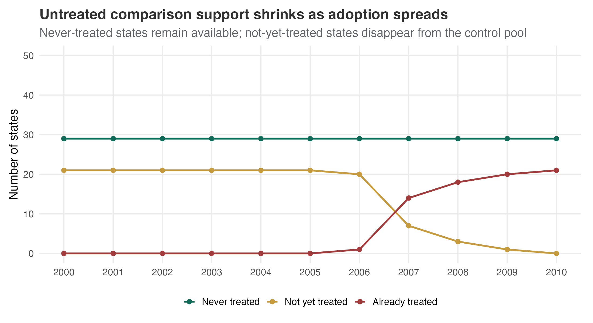
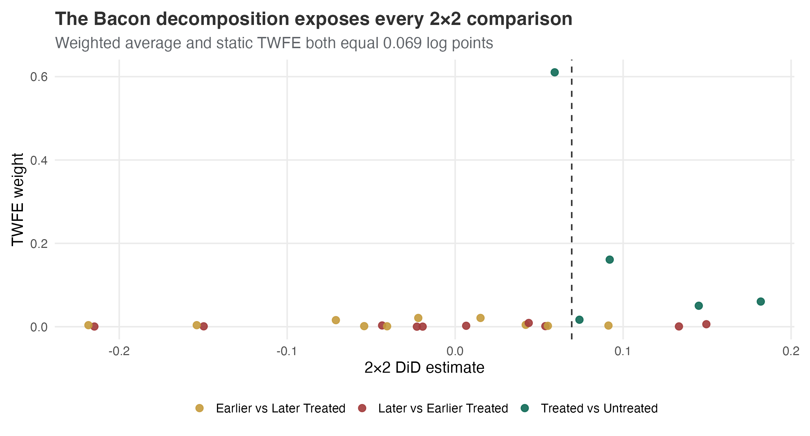
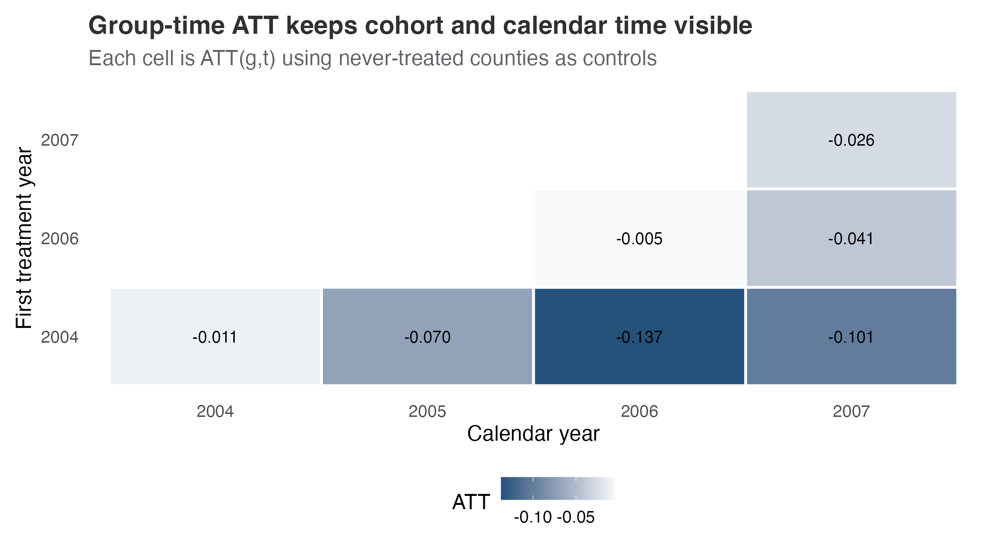
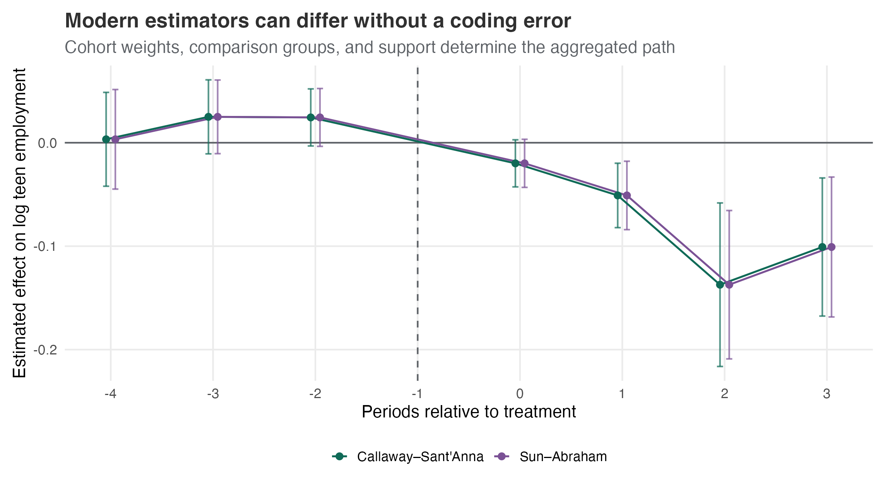

## The subtraction is simple; the comparison is the design

::: {.kicker}
Difference-in-differences estimates how the treated group's change differs from a credible untreated change.
:::

- four means make the canonical contrast transparent
- parallel trends gives that contrast causal meaning
- staggered adoption changes which groups are compared
- modern estimators make timing, controls, and aggregation explicit

::: {.notes}
[Sources] Canonical and modern DiD principles: @gertler2016ch7did; @huntingtonklein2021did; @roth2023trending.
:::

## Kentucky's policy creates a transparent 2×2 question

| Design element | Kentucky workers' compensation |
|---|---|
| Policy | Higher cap on covered weekly earnings in 1980 |
| Exposed group | High-earning claimants |
| Comparison group | Low-earning claimants |
| Outcome | Log duration of benefit receipt |
| Target | High-earner change minus low-earner change |

Low earners construct the missing change for high earners—not because they have the same outcome level, but because their untreated change is assumed to be informative [@meyer1995workerscomp].

::: {.notes}
[Sources] Kentucky policy and data: @meyer1995workerscomp. Teaching workflow: @heiss2026didexample.
:::

## Four means produce one DiD estimate

{fig-alt="Four-cell means plot: high earners rise from roughly 1.38 to 1.58 log weeks, while low earners rise only slightly from roughly 1.13 to 1.14; the resulting difference-in-differences estimate is 0.191 log points." width="91%"}

The high-earner outcome rises more than the low-earner outcome: the DiD estimate is `0.191` log points, or about `21.0%` after exact exponentiation.

::: {.notes}
[Sources] Asset generated from `wooldridge::injury`, documented in @meyer1995workerscomp and used in @heiss2026didexample.
:::

## The interaction regression recovers the same contrast

$$
Y_{it} = \alpha + \gamma Treated_i + \lambda Post_t
+ \tau(Treated_i \times Post_t) + \varepsilon_{it}
$$

| Calculation | Estimate |
|---|---:|
| Change for high earners | `0.199` |
| Change for low earners | `0.008` |
| Difference of changes | `0.191` |
| Regression interaction $\widehat{\tau}$ | `0.191` |

Regression has not changed the identifying comparison. It has represented it in a form that supports inference and extensions.

::: {.notes}
[Sources] Regression representation and four-cell equivalence: @gertler2016ch7did; @huntingtonklein2021did; @heiss2026didexample.
:::

## Parallel trends supplies the missing untreated change

{fig-alt="Two-period trends plot: the dashed untreated counterfactual for high earners follows the small change observed among low earners, leaving a 0.191 log-point gap from the observed post-policy high-earner mean." width="91%"}

The causal claim is that the dashed point approximates what high earners would have experienced without the higher cap.

::: {.notes}
[Sources] Parallel-trends counterfactual logic: @gertler2016ch7did; @huntingtonklein2021did. Asset generated from `wooldridge::injury`.
:::

## Two periods cannot diagnose that assumption

One pre-policy mean per group reveals a baseline gap, but not a pre-policy trend.

What can strengthen the design:

- institutional evidence for why groups should share shocks
- additional pre-treatment periods and raw outcome plots
- alternative credible controls and placebo dates or outcomes
- transparent sensitivity to departures from parallel trends

::: {.signal}
Observed pre-trends can challenge parallel trends; they cannot prove it.
:::

::: {.notes}
[Sources] Parallel-trends diagnostics and limits: @gertler2016ch7did; @roth2022pretest; @rambachanroth2023parallel.
:::

## Anticipation, spillovers, and composition can break the design

| Threat | Failure mode |
|---|---|
| Anticipation | Outcomes change before the recorded treatment date |
| Spillovers | Treatment changes the outcomes of comparison units |
| Composition | Different people or measurements enter the groups over time |

Stable group labels are not enough. The treatment, sample, outcome, and comparison relationship must remain well defined.

::: {.notes}
[Sources] DiD design threats: @cunningham2021did; @callaway2021multipletime; @roth2023trending.
:::

## Inference follows policy assignment, not the number of rows

The Kentucky sample contains `5,626` claims but only:

- two policy groups
- one policy change
- one before/after contrast

Heteroskedasticity-robust errors allow claim-level variance to differ. They do not create thousands of independent policy assignments. In panels, clustering should usually respect the unit where treatment and serial dependence vary [@bertrand2004trustdid].

::: {.notes}
[Sources] Serial correlation and DiD inference: @bertrand2004trustdid. Kentucky sample structure: @meyer1995workerscomp.
:::

## Staggered adoption changes what TWFE estimates

{fig-alt="State-by-year tile plot: castle-doctrine laws begin in different years across states, treated states remain treated, and a group of states is never treated during 2000 to 2010." width="92%"}

With multiple adoption dates, there is no longer one treated group, one control group, and one post period [@cheng2013castle].

::: {.notes}
[Sources] Asset generated from `causaldata::castle`, based on @cheng2013castle and used in @cunningham2021did.
:::

## Untreated comparison support shrinks over calendar time

{fig-alt="Line chart: the number of not-yet-treated states declines as adoption accumulates, already-treated states increase, and never-treated states remain constant, showing shrinking untreated support over time." width="90%"}

Not-yet-treated states expand early support, but they leave the untreated pool when they adopt. Never-treated states remain available throughout.

::: {.notes}
[Sources] Comparison-group support under staggered adoption: @callaway2021multipletime; @roth2023trending. Asset generated from `causaldata::castle`.
:::

## TWFE mixes untreated and already-treated comparisons

| 2×2 comparison | Control status | Main concern |
|---|---|---|
| Treated vs never treated | Untreated throughout | Substantive comparability |
| Earlier vs later treated | Not yet treated | Anticipation and cohort differences |
| Later vs earlier treated | Already treated | Dynamic effects contaminate the control |

If effects vary by cohort or exposure length, a static TWFE coefficient need not represent the policy estimand the analyst intended [@goodmanbacon2021timing].

::: {.notes}
[Sources] TWFE decomposition and treatment-effect heterogeneity: @goodmanbacon2021timing.
:::

## The Bacon decomposition reconstructs—and exposes—the coefficient

{fig-alt="Bacon decomposition scatter plot: component two-by-two estimates vary in sign and size across treated-versus-untreated, earlier-versus-later, and later-versus-earlier comparisons; their weighted sum equals the TWFE estimate of 0.069." width="92%"}

The weighted comparisons reproduce the static TWFE estimate exactly. Reconstruction verifies the calculation; it does not validate every comparison.

::: {.notes}
[Sources] Decomposition method: @goodmanbacon2021timing. Asset generated with `bacondecomp::bacon()` from `causaldata::castle`.
:::

## Conventional event studies can mix effects across relative times

$$
Y_{it}=\alpha_i+\lambda_t+\sum_{e\neq-1}\beta_e\,1\{t-G_i=e\}+\varepsilon_{it}
$$

Under staggered adoption, a conventional $\beta_e$ may use already-treated cohorts as controls and absorb treatment effects belonging to other relative times.

- apparent leads can be created by post-treatment heterogeneity
- lags need not be clean exposure-length effects
- adding more fixed effects does not remove the contamination

::: {.notes}
[Sources] Event-study contamination under heterogeneous effects: @sunabraham2021dynamic; @roth2023trending.
:::

## Sun-Abraham restores cohort-relative comparisons

{fig-alt="Event-study comparison: conventional TWFE and Sun-Abraham estimates differ across relative time, especially after adoption, because Sun-Abraham uses cohort-relative comparisons that avoid already-treated controls." width="92%"}

Sun–Abraham estimates cohort-by-relative-time effects and aggregates them with explicit cohort shares. The profile changes because the comparison logic changes [@sunabraham2021dynamic].

::: {.notes}
[Sources] Interaction-weighted event study: @sunabraham2021dynamic. Asset generated with `fixest::sunab()` from `causaldata::castle`.
:::

## Group-time ATT names the estimand before aggregation

{fig-alt="Heatmap of group-time average treatment effects: rows are minimum-wage treatment cohorts, columns are calendar years, and cell colours show heterogeneous effects with different support across cohort and time combinations." width="87%"}

$$
ATT(g,t)=E[Y_t(1)-Y_t(0)\mid G=g]
$$

Each cell names the cohort, calendar period, and control rule before results are averaged [@callaway2021multipletime].

::: {.notes}
[Sources] Group-time ATT: @callaway2021multipletime. Asset generated with `did::att_gt()` from `did::mpdta`.
:::

## Control groups require different assumptions

| Control rule | What it uses | What must be credible |
|---|---|---|
| Never treated | Units untreated for the full panel | Their trends represent adopting cohorts |
| Not yet treated | Never-treated plus future adopters before adoption | Future adopters are valid controls before treatment |

The larger control pool can improve support. It is not automatically the better design.

::: {.notes}
[Sources] Never-treated and not-yet-treated comparison groups: @callaway2021multipletime; @roth2023trending.
:::

## Aggregation answers different policy questions

| Aggregation | Question |
|---|---|
| Simple | What is the average available post-treatment effect? |
| Cohort | How do effects differ by first treatment year? |
| Event time | How do effects evolve with exposure length? |
| Calendar time | How do effects differ across common shocks and years? |

Weights should follow the policy question, not whichever summary looks strongest.

::: {.notes}
[Sources] Group-time aggregation and weighting: @callaway2021multipletime; @roth2023trending.
:::

## Modern estimates differ when their targets differ

{fig-alt="Dynamic-estimate comparison: Callaway-Sant'Anna and Sun-Abraham paths and confidence intervals are similar in broad direction but not numerically identical across event time because their targets and weights differ." width="92%"}

Cohort weights, nuisance estimation, comparison rules, and event-time support can all move the aggregated path. Numerical equality is not the validity criterion.

::: {.notes}
[Sources] Estimator comparison: @callaway2021multipletime; @sunabraham2021dynamic; @roth2023trending. Asset generated from `did::mpdta`.
:::

## Pre-trend tests are diagnostics, not certification

A non-significant lead can mean:

- untreated trends are genuinely similar
- the test has little power
- confidence intervals allow important violations
- the reported specification was selected after testing

Use raw trends, simultaneous bands, institutional evidence, and prespecified diagnostics together. Do not convert “failed to reject” into “parallel trends holds” [@roth2022pretest].

::: {.notes}
[Sources] Risks of pre-testing and low-power lead tests: @roth2022pretest; @roth2023trending.
:::

## Sensitivity asks how much violation changes the conclusion

{fig-alt="Sensitivity interval plot for the 2006 cohort: robust confidence intervals widen as the allowed post-treatment trend violation grows relative to observed pre-treatment deviations, eventually crossing zero." width="88%"}

`HonestDiD` replaces an all-or-nothing assumption with stated restrictions on how post-treatment trend violations may differ from observed pre-treatment deviations [@rambachanroth2023parallel].

::: {.notes}
[Sources] Sensitivity framework: @rambachanroth2023parallel. Asset generated from the 2006 `did::mpdta` cohort and never-treated counties with `HonestDiD`.
:::

## Estimator choice should follow the design

| Design | First estimator | Required discipline |
|---|---|---|
| Two groups, two periods | Four-cell DiD or interaction | Defend the single comparison trend |
| Common treatment date, multiple periods | Event study or panel DiD | Diagnose pre-period and effect dynamics |
| Staggered adoption, heterogeneous effects | Group-time ATT or interaction-weighted event study | State controls and aggregation |
| Credible untreated outcome model | Imputation estimator | Validate untreated predictions and support |

No estimator repairs anticipation, spillovers, unstable measurement, or an indefensible control group.

::: {.notes}
[Sources] Modern estimator decision framework: @roth2023trending; @callaway2021multipletime; @sunabraham2021dynamic; @borusyak2024eventstudy.
:::

## The three labs turn the reporting chain into practice

| Lab | Core question |
|---|---|
| [Foundations](../labs/difference-in-differences-foundations-lab.qmd) | How do four means, regression, and assumptions connect? |
| [Staggered diagnostics](../labs/difference-in-differences-staggered-diagnostics-lab.qmd) | Which comparisons and event-time effects enter TWFE? |
| [Modern estimators](../labs/difference-in-differences-modern-estimators-lab.qmd) | How do controls, aggregation, and sensitivity change the result? |

::: {.signal}
The estimator calculates the contrast; the design determines which comparisons deserve causal meaning.
:::

Start with the foundations lab, then carry the same reporting chain into the staggered cases.

::: {.notes}
[Sources] Lab sequence synthesizes @gertler2016ch7did; @goodmanbacon2021timing; @callaway2021multipletime; @rambachanroth2023parallel.
:::

## Appendix: Covariates make parallel trends conditional {.section-slide}

Covariate adjustment can support a design when untreated trends are credible **conditional on pre-treatment characteristics**.

- use variables measured before treatment or unaffected by it
- check overlap within the relevant cohorts and periods
- distinguish a changing sample from a changing coefficient
- do not describe adjustment as a repair for unobserved differential trends

::: {.notes}
[Sources] Conditional and doubly robust DiD: @abadie2005semiparametricdid; @santannazhao2020drdid.
:::

## Appendix: Repeated cross-sections change who is compared

Panel DiD follows the same units. Repeated cross-sectional DiD compares changing samples from stable populations.

The added requirement is that treatment does not differentially change:

- who enters the sample
- eligibility and denominator rules
- outcome measurement
- the population represented by each group-period cell

::: {.notes}
[Sources] Repeated cross-sectional DiD and composition: @abadie2005semiparametricdid; @cunningham2021did.
:::

## Appendix: Imputation makes the untreated model explicit

1. Fit the untreated outcome model using untreated observations.
2. Predict untreated potential outcomes for treated observations.
3. Subtract predictions from observed treated outcomes.
4. Aggregate treated-cell effects to the policy estimand.

The workflow is transparent about where untreated information enters, but still depends on a credible untreated model and supported extrapolation [@borusyak2024eventstudy].

::: {.notes}
[Sources] Imputation event-study estimator: @borusyak2024eventstudy.
:::

## Appendix: R packages implement different objects

| Package | Main object |
|---|---|
| `lm`, `fixest::feols()` | Canonical interaction or TWFE model |
| `bacondecomp::bacon()` | TWFE 2×2 estimates and weights |
| `fixest::sunab()` | Cohort-relative interaction-weighted effects |
| `did::att_gt()` and `aggte()` | Group-time effects and explicit aggregation |
| `HonestDiD` | Sensitivity intervals for event-study estimands |

Software choice follows the estimand and assumptions—not the other way around.

::: {.notes}
[Sources] Method objects correspond to @goodmanbacon2021timing; @sunabraham2021dynamic; @callaway2021multipletime; @rambachanroth2023parallel.
:::

## Sources {.smaller .scrollable}

- @abadie2005semiparametricdid
- @bertrand2004trustdid
- @borusyak2024eventstudy
- @callaway2021multipletime
- @cheng2013castle
- @gertler2016ch7did
- @goodmanbacon2021timing
- @heiss2026didexample
- @huntingtonklein2021did
- @meyer1995workerscomp
- @rambachanroth2023parallel
- @roth2022pretest
- @roth2023trending
- @santannazhao2020drdid
- @sunabraham2021dynamic
