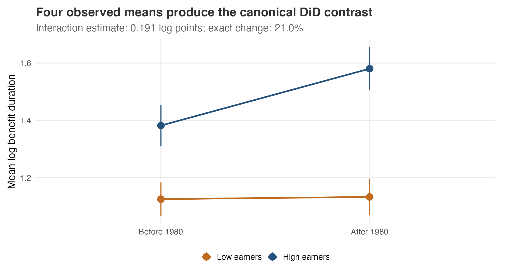
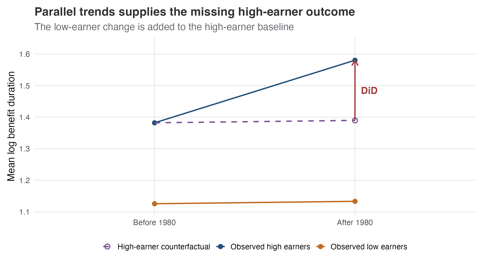
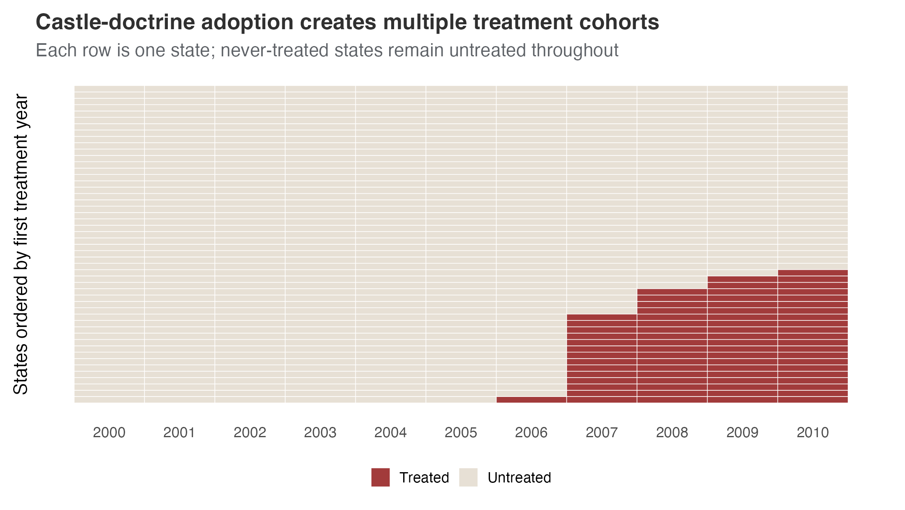
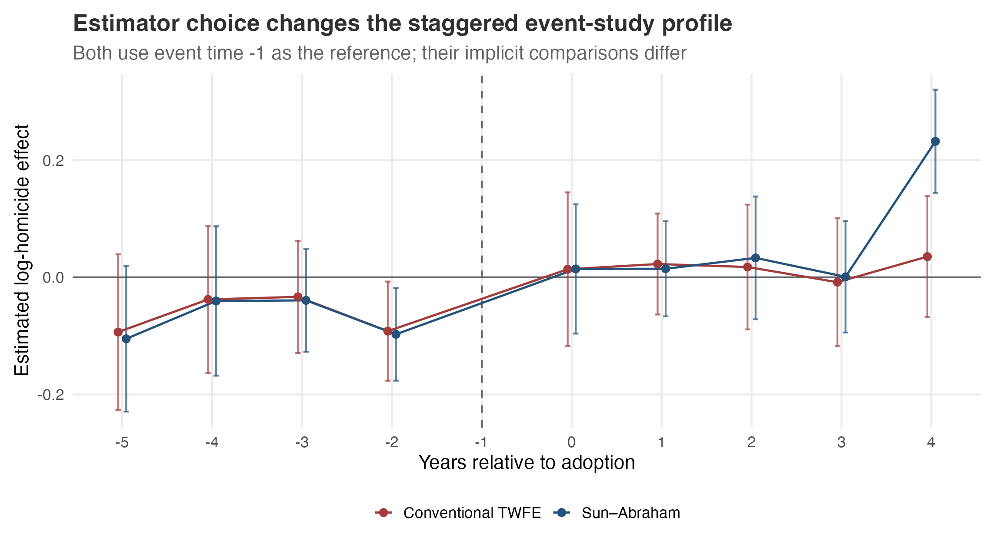
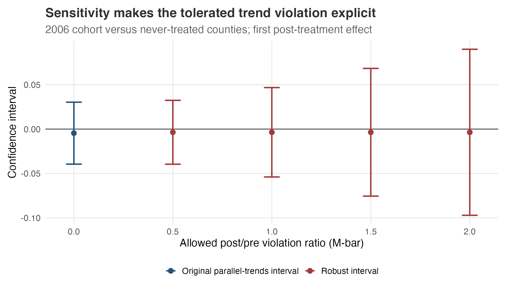

## The question DiD answers

How much did the treated group's outcome change **beyond the change a credible comparison group experienced**?

By the end, you should be able to calculate a DiD, explain its assumptions, and choose comparisons for staggered adoption.

::: {.notes}
Allow 2 minutes. Ask for a policy whose before/after change might reflect another economic shock. The comparison supplies the missing untreated change. Basic regression knowledge is enough for this session. The conceptual session lasts 45–60 minutes with discussion; code belongs in the R labs. Sources: @gertler2016ch7did; @roth2023trending.
:::

## Kentucky workers’ compensation

| Design element | Teaching application |
|---|---|
| Reform | Higher covered-earnings cap in 1980 |
| Treated group | High-earning claimants |
| Comparison | Low-earning claimants |
| Outcome | Log benefit duration |

Different claims are observed before and after: this is a repeated-cross-section design.

::: {.notes}
Allow 2 minutes. The reform changes incentives differently for high and low earners. Ask why low earners could be useful even if their durations start lower. Clarify that group membership is not random assignment, and treatment can change claiming behavior. Sources: @meyer1995workerscomp; @heiss2026didexample.
:::

## Four observed means

{height="430px" fig-alt="Mean log benefit duration by earnings group before and after the Kentucky reform."}

Baseline differences are allowed. The comparison concerns changes.

::: {.notes}
Allow 2 minutes. Have learners identify the four cells and the two group-specific changes. Error bars describe uncertainty in means; they do not display uncertainty in the final DiD or establish policy-level replication. The asset is generated from the same Kentucky sample as the foundations labs. Sources: @meyer1995workerscomp; @heiss2026didexample.
:::

## The difference of changes

| Calculation | Log points |
|---|---:|
| High-earner change | 0.199 |
| Low-earner change | 0.008 |
| Difference-in-differences | **0.191** |

$$\widehat\tau=(\bar Y_{T,after}-\bar Y_{T,before})-(\bar Y_{C,after}-\bar Y_{C,before})$$

::: {.notes}
Allow 3 minutes, including a hand calculation. The displayed values are rounded; the executed estimate is 0.1906012007. Ask what the treated group's change alone would claim. The control change adjusts for an assumed shared untreated trend, not every concurrent event. Sources: @gertler2016ch7did; @heiss2026didexample.
:::

## The missing counterfactual

{height="430px" fig-alt="The dashed high-earner path applies the low-earner change to the high-earner baseline."}

The dashed endpoint is what high earners are assumed to experience without the reform.

::: {.notes}
Allow 2 minutes. Distinguish observed points from the unobserved counterfactual. It is not a fitted fact whose accuracy can be checked in the treated after-period. Ask what a high-earner-specific economic shock would do to the comparison. Sources: @gertler2016ch7did; @huntingtonklein2021did.
:::

## The effect on the treated

$$ATT=E[Y_{after}(1)-Y_{after}(0)\mid Treated=1]$$

- $Y(1)$: outcome under treatment.
- $Y(0)$: outcome without treatment.
- The target is the treated population represented by this design.

An ATT for high earners is not an effect for every worker.

::: {.notes}
Allow 2 minutes. Read the expression in words before explaining symbols. DiD supplies the otherwise missing average untreated outcome for the treated group under assumptions. The policy target and represented claim population need care if the reform affects who enters the sample. Sources: @cunningham2021did; @roth2023trending.
:::

## The interaction regression

$$Y=\alpha+\gamma Treated+\lambda Post+\tau(Treated\times Post)+\varepsilon$$

The interaction coefficient equals the four-cell contrast in this unadjusted model.

Regression expresses the comparison. It does not supply the identifying assumption.

::: {.notes}
Allow 2 minutes. Explain the baseline group gap, common time change, and extra treated-group change. Both languages check equality with the manual estimate. This equality assumes the same rows, weights, and unadjusted saturated model; it need not hold after changing the specification. Sources: @huntingtonklein2021did; @heiss2026didexample.
:::

## Parallel untreated trends

$$E[\Delta Y(0)\mid Treated=1]=E[\Delta Y(0)\mid Treated=0]$$

The groups can start at different levels. Their **untreated changes** must be comparable.

One before-period reveals a baseline gap, not a pre-treatment trend.

::: {.notes}
Allow 3 minutes. Ask learners to explain why observed treated outcomes need not remain parallel after treatment. The assumption concerns untreated potential outcomes, including an unobserved treated-group counterfactual. Additional pre-periods can challenge an argument but cannot prove it. Sources: @gertler2016ch7did; @roth2023trending.
:::

## Outcome scale changes the assumption

A doubling from 10 to 20 and from 20 to 40 gives:

| Scale | First group | Second group |
|---|---:|---:|
| Level change | 10 | 20 |
| Log change | $\log(2)$ | $\log(2)$ |

Kentucky's 0.191 log contrast implies about 21% for a **ratio of geometric-mean changes**.

::: {.notes}
Allow 3 minutes. This doubling example is constructed for teaching. Parallel trends in levels does not imply parallel trends in logs. For Kentucky, exponentiation does not automatically yield the effect on arithmetic mean duration or an average individual percentage effect. Ask which scale fits a proposed policy question. Sources: @huntingtonklein2021did; the foundations-lab calculation.
:::

## Threats to the comparison

| Threat | What can go wrong? |
|---|---|
| Anticipation | Response starts before the coded reform |
| Spillovers | Comparison units are affected |
| Composition | Different people enter the sample |
| Differential shocks | Another event changes only one group |

A modern estimator still needs a credible comparison design.

::: {.notes}
Allow 3 minutes. Ask for one Kentucky-specific threat, such as changes in claim composition. For each answer, distinguish a coding fix from a substantive identification problem. No estimator option automatically removes these threats. Sources: @cunningham2021did; @callaway2021multipletime; @roth2023trending.
:::

## Inference and policy assignment

**5,626 claims do not represent 5,626 independent reforms.**

Serial correlation and shared policy shocks affect uncertainty.

Report the assignment level, dependence structure, and number of independent clusters.

::: {.notes}
Allow 2 minutes. Kentucky has one before/after policy contrast. Claim-level HC1 errors illustrate sampling uncertainty, not a large set of independent policy assignments. State clustering in the castle lab permits within-state dependence. Minimum-wage county clustering reproduces the compact package example but may be inadequate for state-policy inference. Sources: @bertrand2004trustdid; @roth2023trending.
:::

## What pre-trend diagnostics can show

A nonsignificant pre-trend test can still allow a substantively large violation.

Selecting a specification because it passes a pre-test can distort later estimates and intervals.

Raw trends, institutional evidence, and sensitivity analysis each contribute different information.

::: {.notes}
Allow 3 minutes. Ask whether a wide interval containing zero is reassuring. Explain low power and selection as separate problems. Use cohort-aware event-study estimates where timing is staggered; conventional leads can be contaminated by treatment-effect heterogeneity. Sources: @roth2022pretest; @sunabraham2021dynamic.
:::

## Staggered adoption

{height="430px" fig-alt="States adopt castle-doctrine laws in different years; other states remain untreated."}

Control eligibility changes as states adopt.

::: {.notes}
Allow 2 minutes. Identify calendar time and adoption cohort in the graphic. Never-treated states stay untreated throughout the window; not-yet-treated states stop being eligible after exposure. The picture audits coding, not the substantive credibility of the laws' timing. Sources: @cheng2013castle; @goodmanbacon2021timing.
:::

## Already-treated comparisons

Constructed example:

- Early cohort: effect grows from 2 to 5.
- Late cohort: effect rises from 0 to 2.

The later-versus-earlier contrast is $2-(5-2)=-1$.

Both effects are positive, but the contrast subtracts the early cohort's growing effect.

::: {.notes}
Allow 3 minutes. This is a constructed example after cancelling common untreated trends. Ask why a positive decomposition weight on this contrast does not fix the problem. The Bacon decomposition uses nonnegative weights on comparisons, distinct from implicit weights on underlying treatment effects. The R lab verifies the reconstruction. Sources: @goodmanbacon2021timing; @cunningham2021did.
:::

## Event studies and cohort comparisons

{height="430px" fig-alt="Conventional TWFE and Sun–Abraham event-study estimates differ on the same castle-doctrine sample."}

Event time is years since adoption; −1 is the reference period.

::: {.notes}
Allow 3 minutes. The plotted window is -5 through +4, while the regressions include all supported periods. Intervals shown here are pointwise, not simultaneous. Cohort-aware estimation avoids the conventional contamination but still requires identification assumptions. The R cohort-aware estimates are checked against the recorded numerical baseline. Sources: @sunabraham2021dynamic.
:::

## Group-time effects

$$ATT(g,t)=E[Y_t(g)-Y_t(\infty)\mid G=g]$$

$g$ identifies the first-treatment cohort; $t$ identifies calendar time.

Estimate supported cohort-time effects before deciding how to average them.

::: {.notes}
Allow 2 minutes. Explain that Y_t(infinity) represents remaining untreated. Use a 2006 county cohort in 2007 as the example: a particular group at a particular exposure horizon. Not all cohort-time cells are supported. The modern labs use the did package's compact minimum-wage teaching data, not a complete original-paper replication. Sources: @callaway2021multipletime.
:::

## Choosing the comparison group

| Controls | Required comparison |
|---|---|
| Never treated | Units untreated throughout the sample |
| Not yet treated | Also allows future adopters while untreated |

Future adopters can add support. Their untreated trends and lack of anticipation still need justification.

::: {.notes}
Allow 2 minutes. Ask when future adopters might be suspicious controls before formal adoption: anticipation, policy preparation, or differential shocks driving adoption. A larger comparison sample is not automatically a better design. The code specifies the control rule and baseline instead of inheriting defaults. Sources: @callaway2021multipletime; @roth2023trending.
:::

## Aggregation defines the question

| Average | What does it summarize? |
|---|---|
| Simple | Available treated cohort-time cells |
| Cohort | Effects within first-treatment groups |
| Event time | Effects at each exposure horizon |
| Calendar time | Effects in each calendar period |

Long-horizon estimates may represent only early adopters.

::: {.notes}
Allow 3 minutes. Ask learners to compare equal-size cohorts with four and one observed post-periods. The simple supported-cell average gives more total weight to the first. A cohort average and an event average are different targets. Changing sample support can also change who an apparent dynamic path represents. Sources: @callaway2021multipletime; @roth2023trending.
:::

## Sensitivity to nonparallel trends

{height="430px" fig-alt="Sensitivity intervals for the first post-treatment effect of the 2006 cohort include zero at every tested bound."}

State the target and the permitted trend violation together.

::: {.notes}
Allow 3 minutes. The example restricts to the 2006 cohort and never-treated counties. Relative magnitude bounds post-treatment changes in the untreated gap relative to the largest pre-treatment change, accounting for uncertainty. It does not bound levels by the largest observed lead. Zero is already included at the first tested Mbar=0.5; no exact breakdown point is established. This is not sensitivity for the full staggered aggregate. Sources: @rambachanroth2023parallel.
:::

## A DiD reporting checklist

- Policy, population, outcome scale, and target effect.
- Treatment dates, comparison units, and supported periods.
- Parallel-trends argument and main design threats.
- Estimator, aggregation weights, and uncertainty method.
- Diagnostics, sensitivity, and remaining limitations.

::: {.notes}
Allow 2 minutes. Ask participants to describe a prospective analysis in five sentences using these prompts. A package name alone does not describe the estimator's actual comparison or target. The detailed knowledge base supplies source-specific explanations and worked exercises. Sources: @roth2023trending.
:::

## Three R labs

| Lab | What you will do |
|---|---|
| Foundations | Calculate and interpret Kentucky's four-cell contrast |
| Staggered diagnostics | Audit comparisons and event studies using castle laws |
| Modern estimators | Estimate group-time effects and choose aggregation |

[Core report](../labs/difference-in-differences-methods-report.qmd) · [Lab setup and verified outputs](../labs/difference-in-differences-reproducibility.qmd) · [Reading map](../notes/did/difference-in-differences-sources.qmd)

::: {.notes}
Allow 1 minute. Each lab takes 45–60 minutes beyond this introduction. All use R, with Quarto, R Jupyter notebooks, and complete offline bundles. The diagnostics and modern labs include Bacon and HonestDiD extensions. Close with a concrete next step: run foundations and write a six-sentence design assessment.
:::

## Appendix: Covariates make parallel trends conditional

Covariate adjustment can support a design when untreated trends are credible **conditional on pre-treatment characteristics**.

- use variables measured before treatment or unaffected by it
- check overlap within the relevant cohorts and periods
- distinguish a changing sample from a changing coefficient
- do not describe adjustment as a repair for unobserved differential trends

::: {.notes}
[Sources] Conditional and doubly robust DiD: @abadie2005semiparametricdid; @santannazhao2020drdid.
:::

## Appendix: Repeated cross-sections change who is compared

Panel DiD follows the same units. Repeated cross-sectional DiD compares changing samples from stable populations.

The added requirement is that treatment does not differentially change:

- who enters the sample
- eligibility and denominator rules
- outcome measurement
- the population represented by each group-period cell

::: {.notes}
[Sources] Repeated cross-sectional DiD and composition: @abadie2005semiparametricdid; @cunningham2021did.
:::

## Appendix: Imputation makes the untreated model explicit

1. Fit the untreated outcome model using untreated observations.
2. Predict untreated potential outcomes for treated observations.
3. Subtract predictions from observed treated outcomes.
4. Aggregate treated-cell effects to the policy estimand.

The workflow is transparent about where untreated information enters, but still depends on a credible untreated model and supported extrapolation [@borusyak2024eventstudy].

::: {.notes}
[Sources] Imputation event-study estimator: @borusyak2024eventstudy.
:::

## Appendix: R implementations

| Method | R implementation |
|---|---|
| Four-cell regression | `lm` |
| Fixed effects | `fixest` |
| Cohort-aware event study | `fixest::sunab` |
| Group-time effects | `did` |
| Decomposition / sensitivity | `bacondecomp` / `HonestDiD` |

See the lab setup page for the tested environment and verified outputs.

::: {.notes}
[Sources] Method objects correspond to @goodmanbacon2021timing; @sunabraham2021dynamic; @callaway2021multipletime; @rambachanroth2023parallel.
:::

## Sources {.smaller .scrollable}

[Reading map and detailed source notes](../notes/did/difference-in-differences-sources.qmd)

::: {#refs}
:::
