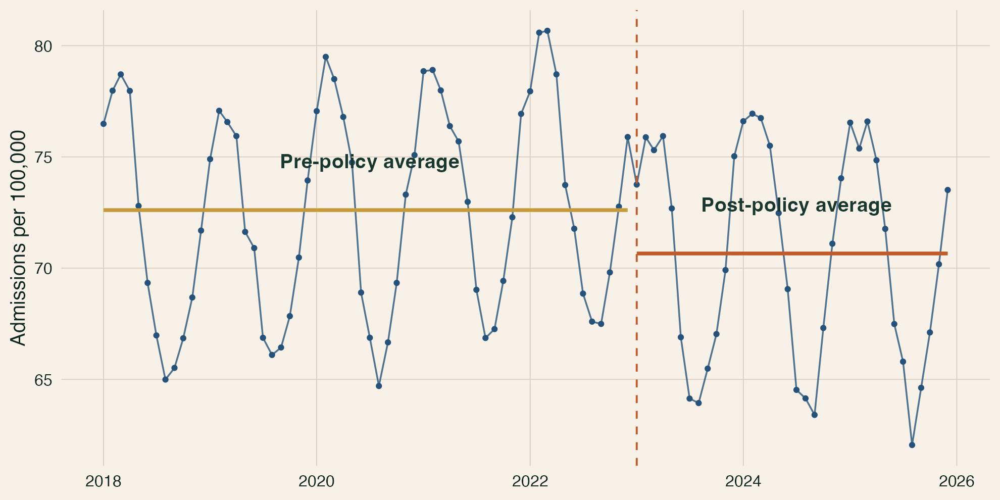
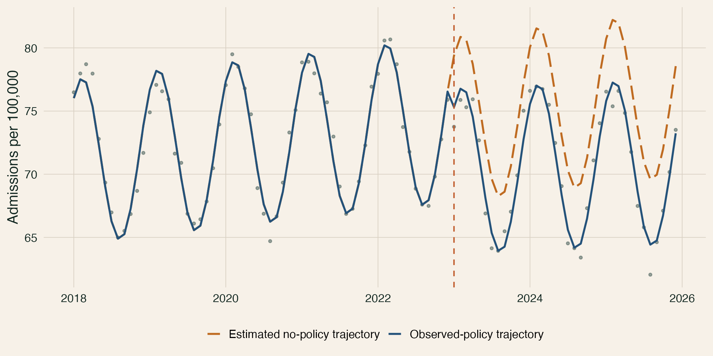
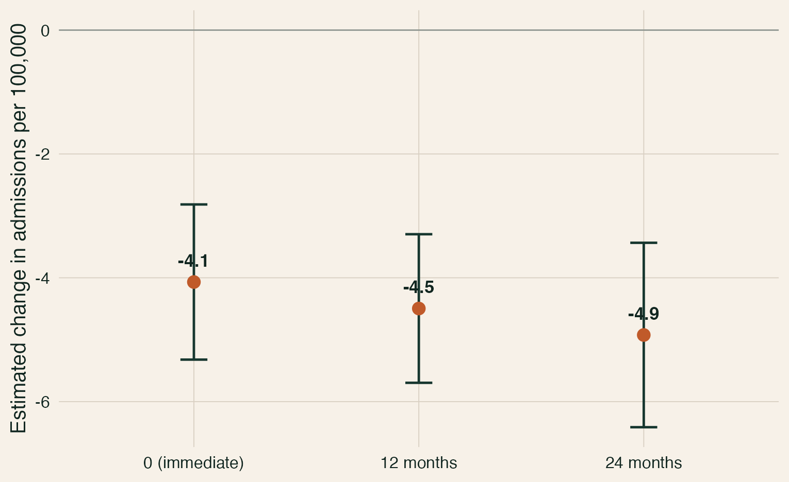
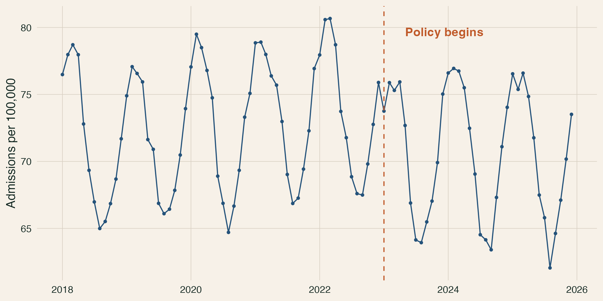
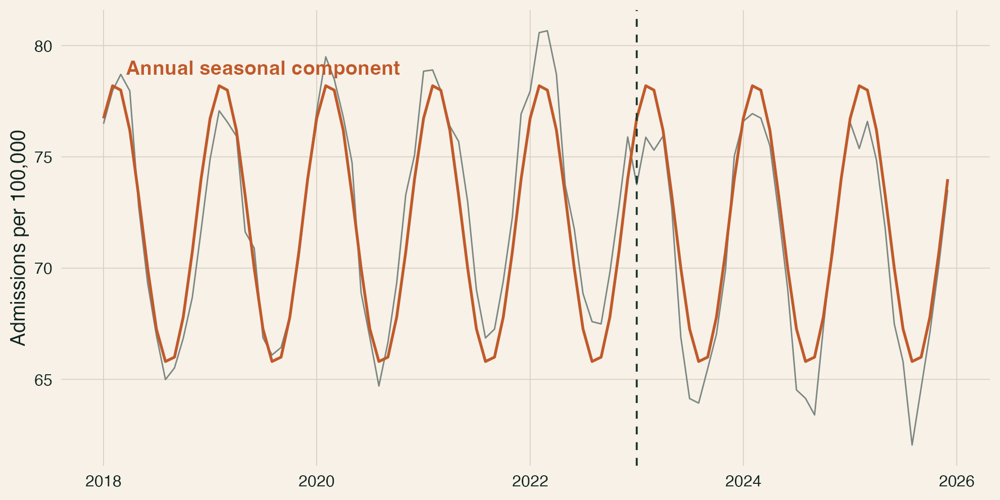
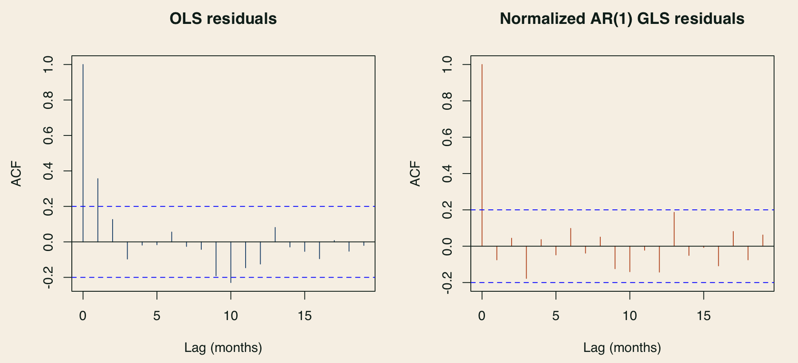
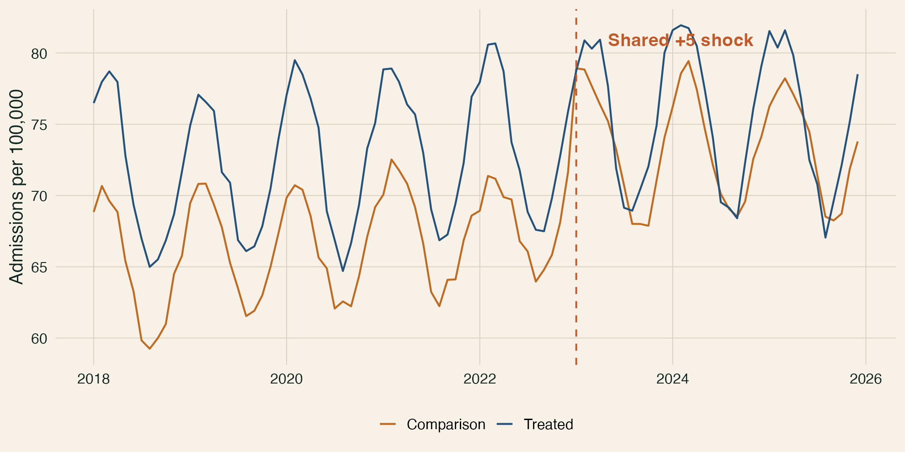

## Session Promise

::: {.kicker}
Interrupted time series estimates a break in a trajectory. The design determines whether that break can be interpreted as causal.
:::

- begin with the missing no-policy path, not the regression command
- separate immediate and gradual effects before looking at estimates
- treat seasonality, autocorrelation, and implementation timing as design inputs
- make concurrent shocks and measurement changes visible limits [@wagner2002segmented; @lopezbernal2017tutorial; @cochrane2024robinsits]

## 20-Minute Arc

| Time | Segment | Purpose |
|---|---|---|
| `0-4` | Counterfactual | Why repeated observations beat a pre/post contrast |
| `4-8` | Impact model | How level, trend, and horizon effects differ |
| `8-12` | Time-series structure | Why plots, seasonality, and autocorrelation matter |
| `12-16` | Causal threats | Why coincident events and measurement breaks dominate |
| `16-20` | Stronger designs | How controls, diagnostics, and the labs sharpen the claim |

## A Pre/Post Difference Has No Trajectory

::: {.columns}
::: {.column width="43%"}
- one average before and one average after discard the shape of the series
- an apparent change may reflect an existing trend or seasonal timing
- uncertainty depends on serial dependence, not only the number of observations

The missing object is the outcome path that would have continued without the policy.
:::

::: {.column width="57%"}
{fig-alt="Monthly respiratory admissions with a policy date and horizontal pre- and post-policy averages, showing that the averages conceal trend and seasonality." width="100%"}
:::
:::

## ITS Projects the Pre-Policy Path Forward

::: {.columns}
::: {.column width="38%"}
The counterfactual is not another observed group. It is the pre-intervention trajectory continued beyond the interruption after accounting for predictable structure.

The estimated effect is the gap between that projected path and the observed post-policy path [@lopezbernal2017tutorial].
:::

::: {.column width="62%"}
{fig-alt="Observed respiratory admissions after a clean-air policy compared with the projected no-policy trajectory." width="100%"}
:::
:::

## The Expected Impact Shape Belongs in the Design

{fig-alt="Four small time-series panels showing immediate, gradual, immediate plus gradual, and temporary intervention effects." width="100%"}

Specify the plausible shape from implementation knowledge before examining the result. Extra flexibility raises the risk of fitting noise [@lopezbernal2017tutorial].

## Segmented Regression Separates Level and Trend Changes

$$
Y_t = \beta_0 + \beta_1t + \beta_2I_t + \beta_3T^{post}_t
      + \text{seasonality}_t + \epsilon_t
$$

| Term | Interpretation |
|---|---|
| $\beta_0$ | baseline level at the chosen time origin |
| $\beta_1$ | pre-intervention trend |
| $\beta_2$ | immediate level change at implementation |
| $\beta_3$ | change in trend after implementation |

The post-intervention trend is $\beta_1 + \beta_3$ [@wagner2002segmented].

## Post-Intervention Time Must Start at Zero

::: {.columns}
::: {.column width="47%"}
**Correct**

```r
intervention <- as.integer(time >= 61)
time_after <- pmax(0, time - 61)
```

At the first intervention observation, `time_after == 0`, so the intervention coefficient is the immediate level change.
:::

::: {.column width="47%"}
**Misleading parameterization**

```r
wrong_time_after <- time * intervention
```

This model can produce identical fitted values while changing what the intervention coefficient means [@xiao2021parameterization].
:::
:::

## The Effect Changes With the Horizon

::: {.columns}
::: {.column width="36%"}
At $h$ periods after implementation:

$$
\text{effect}(h) = \beta_2 + h\beta_3
$$

Its uncertainty must include both coefficient variances and their covariance.
:::

::: {.column width="64%"}
{fig-alt="Point estimates and confidence intervals for the clean-air policy immediately, at 12 months, and at 24 months." width="100%"}
:::
:::

## Plot the Series Before Estimating

{fig-alt="Raw monthly respiratory admissions with a seasonal cycle and a vertical line at the clean-air policy date." width="100%"}

The first plot tests whether the proposed intervention date, trend form, seasonal pattern, outliers, and missing periods are even plausible inputs to a model.

## Seasonality Belongs in the Mean Model

::: {.columns}
::: {.column width="40%"}
- monthly health outcomes often repeat within the year
- a policy introduced in winter can inherit a seasonal rise or fall
- month indicators or Fourier terms are transparent starting points
- the representation should match the outcome process, not whichever term is significant
:::

::: {.column width="60%"}
{fig-alt="Monthly admissions and the annual seasonal component used in the clean-air simulation." width="100%"}
:::
:::

## Autocorrelation Belongs in the Error Model

::: {.columns}
::: {.column width="38%"}
Adjacent observations share information. Ignoring that dependence can make uncertainty too optimistic and can leave model misspecification hidden.

An AR(1) structure is a starting hypothesis for this simulation, not a universal ITS default.
:::

::: {.column width="62%"}
{fig-alt="Residual autocorrelation plots for ordinary least squares and generalized least squares with AR1 errors." width="100%"}
:::
:::

## A Concurrent Shock Can Mimic the Policy

::: {.signal}
An uncontrolled ITS cannot distinguish the policy from another outcome-relevant event beginning at the same time.
:::

- policy bundles, strikes, economic shocks, eligibility changes, and service disruptions can generate the same segmented-regression terms
- a precise coefficient does not rule out a coincident explanation
- build a dated context timeline before modelling [@cochrane2024robinsits]

## Measurement Must Not Break With the Policy

| Stable element | Questions to settle |
|---|---|
| Outcome definition | Was the same event counted before and after? |
| Denominator | Did the population at risk change? |
| Coverage | Did sites, systems, or reporting completeness change? |
| Composition | Is the same target population represented over time? |

A reporting-system change is an interruption in measurement, even when it happens on the policy date.

## Timing Should Follow Implementation, Not Significance

::: {.hero-grid}
::: {.hero-card}
### Represent what happened

- anticipation before formal launch
- a known transition window
- gradual coverage or delayed response
- a temporary implementation period
:::

::: {.hero-card}
### Avoid outcome-driven timing

- moving the date to maximize a coefficient
- testing many lags without a prior mechanism
- treating the first visible deviation as implementation
- hiding ambiguous rollout behind a sharp step
:::
:::

## A Credible Control Can Remove Shared Shocks

::: {.columns}
::: {.column width="40%"}
A controlled ITS asks whether the treated series changed more than a contemporaneous, unexposed comparison series.

The control needs comparable measurement, a similar pre-policy trajectory, and no treatment or spillover [@lopezbernal2018controls].
:::

::: {.column width="60%"}
{fig-alt="Treated and comparison admission series both rise at the policy date because of a shared shock, while the treated series also contains the clean-air effect." width="100%"}
:::
:::

## Diagnostics Are Part of the Causal Argument

- compare the proposed trend with a small set of substantively plausible alternatives
- inspect residual time plots, ACF, and PACF rather than applying one test mechanically
- represent known transition windows and investigate exceptional periods
- compare error structures and seasonal specifications without searching for significance
- use negative-control outcomes or a credible comparison series when available

Sensitivity analysis should test named design concerns, not create an unrestricted specification menu.

## Familiar Shortcuts Create Predictable Failures

::: {.card-grid}
::: {.mini-card}
**Two-point ITS**

One observation before and after cannot establish a trajectory.
:::

::: {.mini-card}
**Convenient coding**

`time * intervention` changes the level coefficient's meaning.
:::

::: {.mini-card}
**Causal overclaim**

A corrected standard error does not eliminate concurrent confounding.
:::
:::

## Report the Trajectory, Not Just Coefficients

1. Define the intervention, estimand, timing, and expected impact shape.
2. Describe frequency, measurement, denominator, and observations on each side.
3. Show the observed, fitted, and no-policy trajectories.
4. Report immediate, trend, and horizon effects with uncertainty.
5. Explain the error structure, diagnostics, sensitivities, and concurrent events.
6. Calibrate the causal conclusion to the remaining threats.

## The Labs Move From Mechanics to Design

::: {.lab-grid}
::: {.lab-card}
### ITS Mechanics

Build the variables, expose the coding trap, compare OLS with AR(1) GLS, and estimate policy-relevant horizon effects.
:::

::: {.lab-card}
### ITS Design and Diagnostics

Compare valid, omitted-seasonality, shared-shock, and measurement-break scenarios using uncontrolled and controlled ITS.
:::
:::

## Sources {.smaller .scrollable}

::: {#refs}
:::

## The Design Makes the Break Causal

::: {.kicker}
Plot first. Specify timing and impact shape from implementation knowledge. Diagnose the time-series structure. Then ask whether any other event or measurement change could have produced the same break.
:::

That sequence—not a significant intervention coefficient—is the practical standard for interrupted time series.
