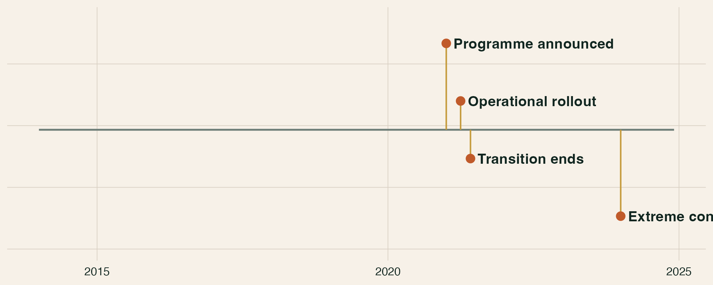
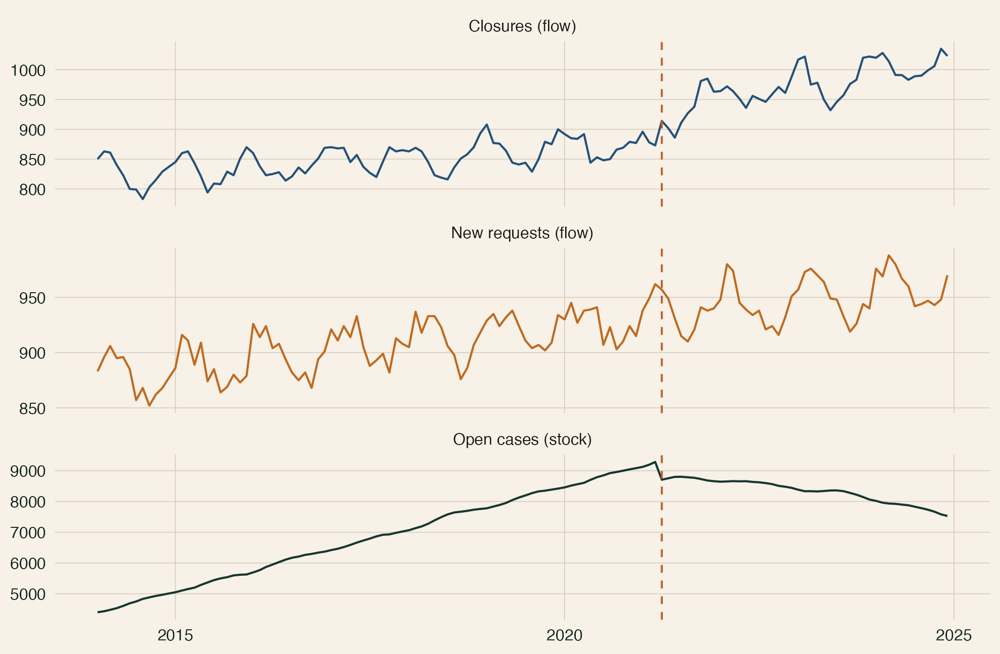
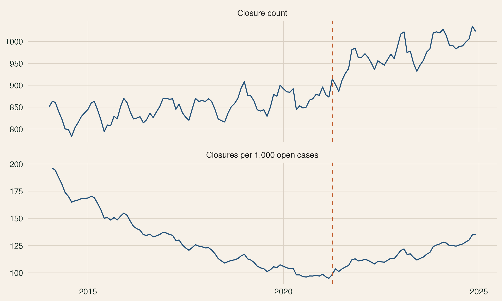
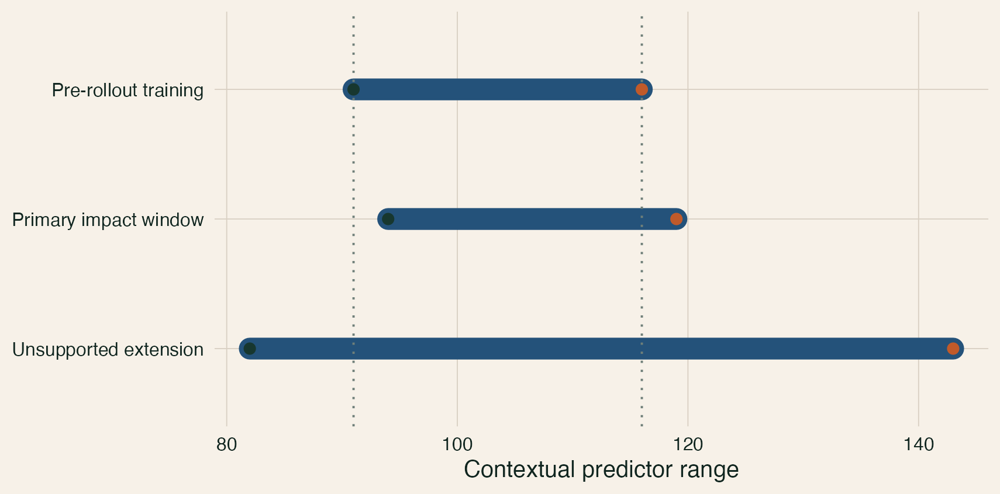
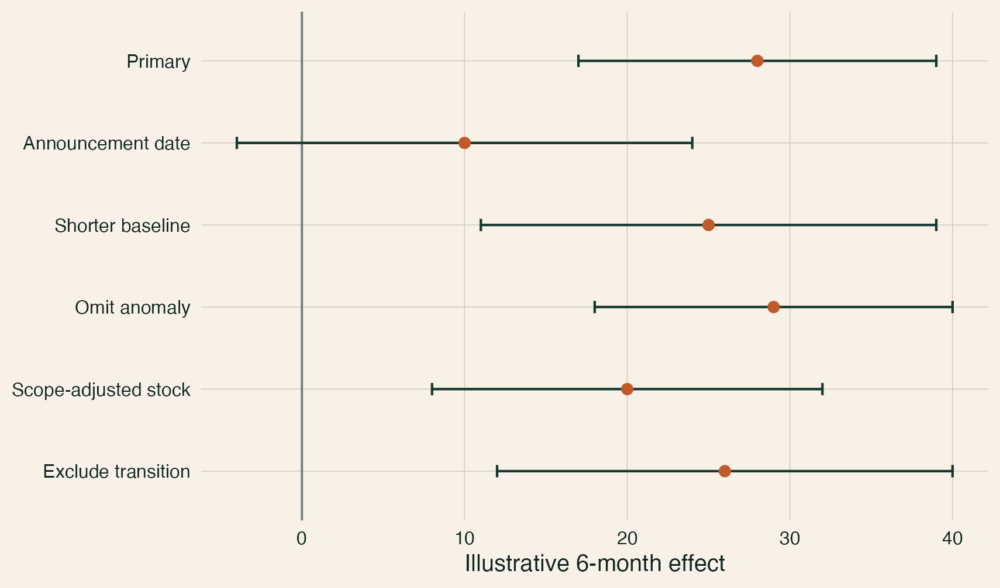

## A break is only as credible as its no-programme path

::: {.kicker}
Interrupted time series estimates how an observed trajectory differs from a projected untreated trajectory. Design, data provenance, and validation determine what that difference means.
:::

- define the outcome system before fitting the break
- distinguish delivery dates from outcome-driven timing
- validate the untreated model without post-intervention outcomes
- treat disagreement and unsupported extrapolation as findings

::: {.notes}
[Sources] General ITS design principles: @wagner2002segmented; @lopezbernal2017tutorial; @cochrane2024robinsits.
:::

## The workflow has three layers

| Layer | Question |
|---|---|
| Data system | What is counted, when, and within which boundary? |
| Counterfactual | Which untreated path predicts held-out pre-programme data? |
| Attribution | Could another event or measurement change create the same gap? |

The labs follow the same route: **data and mechanics → design and diagnostics → counterfactual validation**.

## Begin with events, not coefficients

{fig-alt="Timeline for a synthetic housing-repairs programme showing announcement, operational rollout, transition end, and a later extreme context period." width="96%"}

Announcement, operational rollout, transition, and realised service changes answer different questions. Fix plausible dates from delivery evidence before inspecting outcomes.

## A stock and a flow describe different objects

{fig-alt="Three aligned monthly series for the stock of open repair cases, the flow of new requests, and the flow of case closures." width="92%"}

$$
S_t = S_{t-1} + \text{inflows}_t - \text{outflows}_t + \text{scope changes}_t
$$

An intervention can raise closures without producing the same-sized fall in the open caseload when new demand or reporting scope also changes.

## Reconciliation reveals what the data can support

| Check | What failure can mean |
|---|---|
| Categories sum to the published total | Coding, suppression, or aggregation mismatch |
| Dates are unique and continuous | Duplicate extracts or missing periods |
| Stock-flow identity closes | Unobserved inflows, transfers, revisions, or timing differences |
| Definitions and boundary remain stable | A statistical break rather than a service effect |

An inferred flow is a balancing residual unless every other term is observed on a common basis.

## Counts and rates answer different questions

{fig-alt="Two monthly series comparing the number of repair closures with closures per 1,000 open cases." width="88%"}

- counts describe system volume
- rates describe activity relative to the cases exposed to closure
- a changing denominator can move the rate even when counts are stable
- use the denominator available before the period's events when the estimand is a risk or transition rate

## Repair anomalies transparently—and keep the source visible

1. Detect implausible values through reconciliation and context, not visual preference.
2. Preserve the published value and record the reason, rule, and date of any repair.
3. Compare the primary treatment with omission and retention of the source value.
4. Do not let a single impossible observation determine the baseline trend.

::: {.signal}
Agreement between credible treatments is evidence; choosing the most favourable treatment is not.
:::

## A pre/post average has no trajectory

{fig-alt="Monthly closure rates with horizontal pre- and post-programme averages, illustrating how averages hide trend, seasonality, and transition." width="92%"}

Two averages discard pre-existing trend, seasonal position, and serial dependence. The missing object is the path that would have continued without the programme.

## ITS projects the untreated path forward

{fig-alt="Observed repair-service closure rates with fitted programme and estimated no-programme trajectories after rollout." width="92%"}

The gap is estimated, not observed. Its causal interpretation depends on the stability of the pre-programme relationship and the absence of competing same-date explanations [@lopezbernal2017tutorial].

## Specify the plausible effect shape before estimation

{fig-alt="Four panels showing immediate, gradual, immediate plus gradual, and temporary intervention effects." width="100%"}

Rollout knowledge should determine whether the model allows a level shift, slope change, temporary pulse, transition, or phased response. Flexibility chosen after viewing results is specification search.

## Segmented regression separates level and trend changes

$$
Y_t = \beta_0 + \beta_1t + \beta_2A_t + \beta_3I_t + \beta_4T^{post}_t
      + \text{seasonality}_t + \epsilon_t
$$

| Term | Interpretation |
|---|---|
| $A_t$ | Prespecified announcement pulse |
| $I_t$ | Immediate change at operational rollout |
| $T^{post}_t$ | Change in trend after rollout |

The post-programme trend is the baseline trend plus the trend-change coefficient [@wagner2002segmented].

## Post-intervention time starts at zero

::: {.columns}
::: {.column width="47%"}
### Interpretable coding

```r
implemented <- as.integer(time >= 88)
time_after <- pmax(0, time - 88)
```

At rollout, `time_after == 0`; the implementation coefficient is the immediate change.
:::

::: {.column width="47%"}
### Misleading coding

```r
wrong_time_after <- time * implemented
```

Fitted values may be identical while the implementation coefficient moves to an irrelevant time origin [@xiao2021parameterization].
:::
:::

## The effect changes with the horizon

{fig-alt="Estimated immediate, six-month, and twelve-month programme effects with confidence intervals." width="75%"}

At horizon $h$, the segmented effect is $\beta_3 + h\beta_4$. Its uncertainty must include the covariance between the level and trend terms.

## Seasonality belongs in the mean model

{fig-alt="Monthly repair closure rates with the annual seasonal component highlighted." width="90%"}

A predictable annual cycle is part of the expected outcome path. Month indicators or Fourier terms are transparent starting points; an autoregressive error should not be asked to absorb omitted seasonality.

## Serial dependence belongs in the error model

{fig-alt="Residual autocorrelation plots for ordinary least squares and normalized AR1 generalized least-squares residuals." width="84%"}

OLS, heteroskedasticity-and-autocorrelation-consistent uncertainty, and autoregressive errors address dependence differently. None removes concurrent confounding or repairs a measurement break.

## A comparison series can remove a shared shock

{fig-alt="Synthetic programme and comparison-area closure rates both responding to a shared shock after rollout." width="91%"}

A controlled ITS estimates whether the programme area changed more than an unexposed comparison. Comparable measurement, a credible pre-trend, and no spillover are design requirements [@lopezbernal2018controls].

## A control cannot repair a treated-only measurement break

| Scenario | What the contrast can recover |
|---|---|
| Shared demand shock | The programme-area change beyond the common shock |
| Boundary transfer affecting both series comparably | Potentially the differential programme change |
| Programme-area reporting migration | Policy and measurement remain observationally combined |
| Contaminated comparison | The contrast is no longer untreated |

Controls solve specific identification problems—not every same-date discontinuity.

## Contextual variables need a causal role

Include a contextual predictor only when it:

- represents a plausible common cause or strong untreated predictor
- is measured independently of the programme
- is not changed by the programme
- covers the same forecast origins and remains within defensible support

Correlated measures of one mechanism are alternatives, not an automatic adjustment set.

::: {.notes}
[Sources] Theory-led covariate selection and outcome-free validation principles: @vanderweele2019; @bergmeir2018.
:::

## Fit is not counterfactual performance

::: {.columns}
::: {.column width="46%"}
### In-sample fit

Answers how closely a model describes observations used to estimate it.
:::

::: {.column width="46%"}
### Pre-programme validation

Answers how accurately the model predicts untreated observations it did not see.
:::
:::

Model selection for the no-programme path must exclude every post-rollout outcome.

## Validate at the horizons the evaluation will report

{fig-alt="Normalized forecast error for seasonal-naive, trend, autoregressive, and contextual models at three, six, and twelve months." width="84%"}

Use identical expanding-window origins, compare each model with a transparent naive benchmark, and aggregate predeclared horizon scores. A one-step winner need not be the best twelve-month counterfactual [@bergmeir2018].

## Preserve model disagreement

- use the prespecified validation rule for the primary path
- retain a near-performing model built on a different assumption
- report conclusions shared by both before model-specific totals
- interpret divergence as sensitivity to trend, persistence, or context

“Selected” means selected by an outcome-free forecasting rule—not proven causally true.

## Cumulative effects depend on exposure and recursion

For a flow outcome, report both:

1. the rate gap at each policy-relevant horizon; and
2. the cumulative observed-minus-expected flow over the same window.

Applying counterfactual rates to observed exposure answers a different question from simulating the no-programme stock and its future exposure. Label the choice and test the alternative.

## Prediction intervals are not causal confidence intervals

Forecast intervals describe uncertainty under a specified untreated model. They do not include every source of:

- model selection uncertainty
- boundary or measurement uncertainty
- concurrent interventions
- missing comparison groups
- unsupported long-run extrapolation

Calibrate the claim to design uncertainty as well as model uncertainty.

## Stop when the predictors leave their training support

{fig-alt="Ranges of a contextual predictor during pre-rollout training, the primary impact window, and an unsupported extension beyond the training range." width="82%"}

Supplying an extreme observed predictor value does not make extrapolation reliable. A coefficient learned inside one range remains an assumption outside it.

## Sensitivity checks should name the threat

::: {.columns}
::: {.column width="58%"}
{fig-alt="Point and interval estimates for a primary model and checks using announcement timing, a shorter baseline, anomaly omission, scope adjustment, and transition exclusion." width="100%"}
:::

::: {.column width="39%"}
- timing: announcement versus rollout
- anomaly: repair, omit, retain
- baseline: prespecified shorter starts
- boundary: published versus constant scope
- false breaks: placebo dates
:::
:::

## Placebo dates are diagnostics, not magic p-values

Apply the same local specification at false dates wholly before the intervention. Ask whether breaks of similar size occur when no programme was present.

- overlapping dates are dependent
- the real date was not randomly assigned
- placebo results reveal instability; they do not create randomisation

## Report a chain of evidence

1. Define the intervention, outcome system, exposure, estimands, and timing.
2. Show validation, reconciliation, and contextual-event evidence.
3. Plot observed, fitted, and no-programme trajectories.
4. Report horizon and cumulative effects with forecast uncertainty.
5. Show the comparator model and named sensitivity checks.
6. State what alternative explanations remain.

## The labs build the complete workflow

| Lab | Learner output |
|---|---|
| Data and mechanics | Validated series, reconciled measures, segmented effects |
| Design and diagnostics | Scenario comparison and causal design memo |
| Counterfactual validation | Outcome-free model selection and forecast report |

## The design makes the break interpretable

::: {.kicker}
Validate the data system. Fix timing from delivery evidence. Select the untreated path without post-programme outcomes. Then ask which other event, boundary change, or unsupported assumption could still explain the gap.
:::

That sequence—not a significant intervention coefficient—is the practical standard for interrupted time series.

## Appendix: dynamic intervention models are different tools {.section-slide}

Autoregressive outcomes, distributed intervention pulses, and autoregressive errors answer different questions. Add dynamics only when the mechanism and pre-intervention validation support them.

## Appendix: ARDL asks about long-run relationships

An autoregressive distributed-lag model asks whether an outcome and contextual series share a stable long-run relationship while allowing short-run adjustment.

- audit integration order; no variable may be integrated of order two
- choose lag orders on a common sample
- treat a statistic between the bounds as inconclusive
- do not convert cointegration evidence into programme attribution

::: {.notes}
[Sources] ARDL bounds-testing framework: @pesaran2001; applied implementation guidance: @natsiopoulos2022.
:::

## Appendix: model selection adds uncertainty

Refit-and-reselect simulation or bootstrap can propagate parameter and selection uncertainty through recursive forecasts. Report those intervals as model-based summaries; the procedure still cannot simulate unknown confounding or undocumented scope changes.

## Appendix: complexity cannot rescue weak design

::: {.signal}
A complex model can forecast well and still answer the wrong causal question.
:::

Use advanced specifications to test a named assumption, improve an untreated forecast, or represent a known mechanism—not to manufacture a preferred result.

## Sources {.smaller .scrollable}

::: {#refs}
:::
