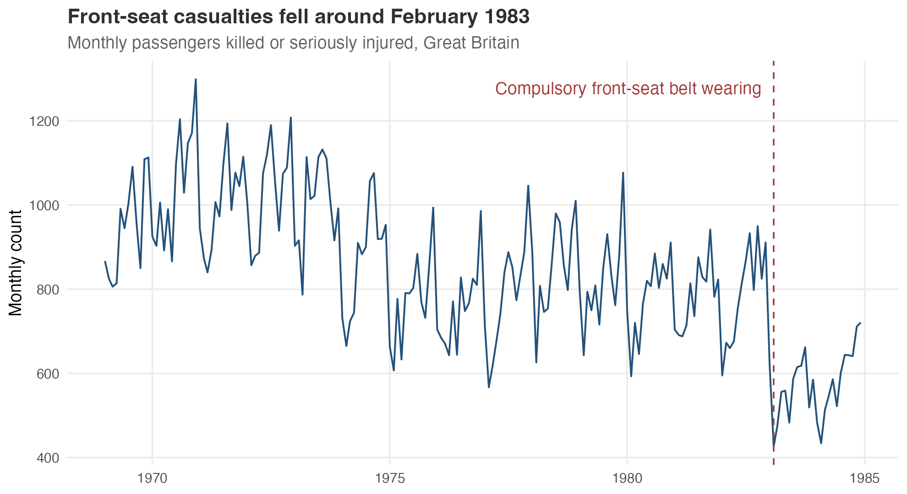
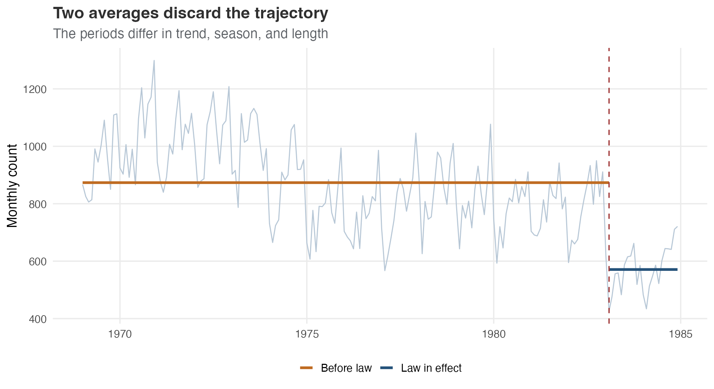
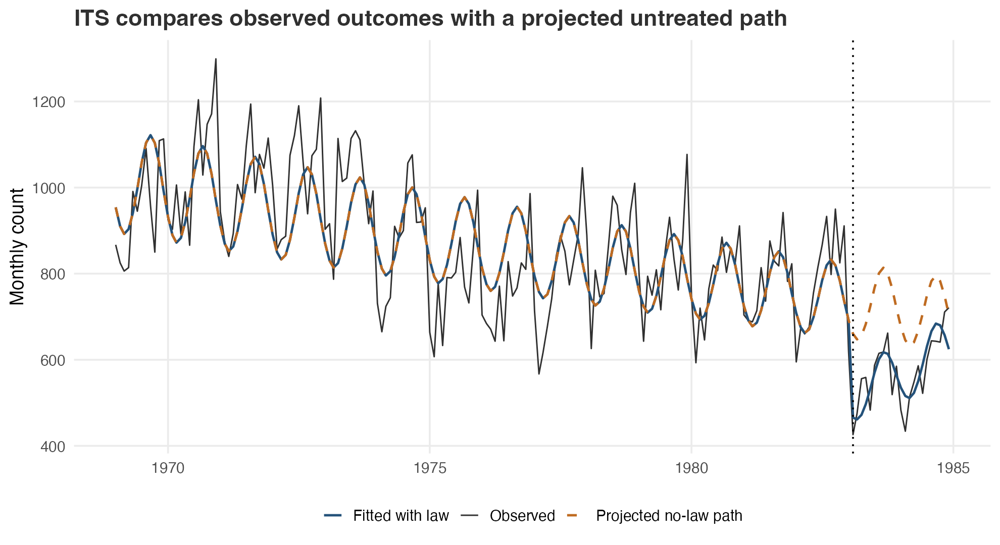
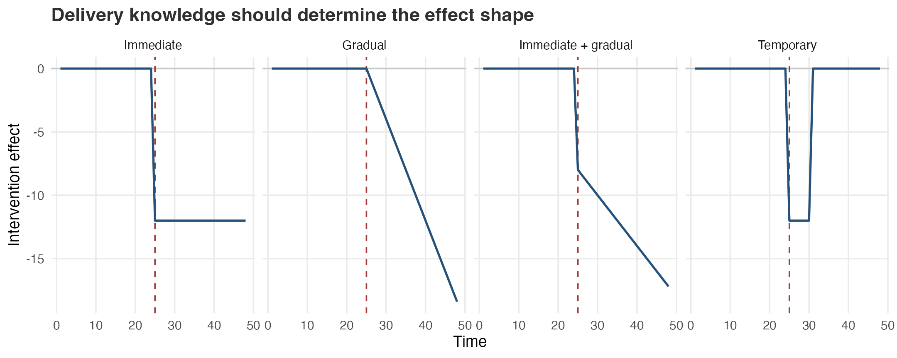
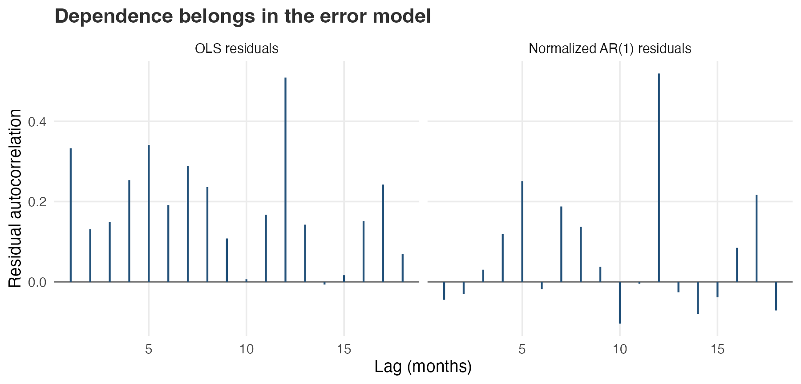
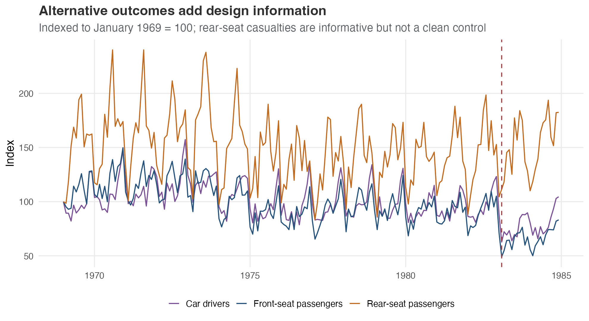
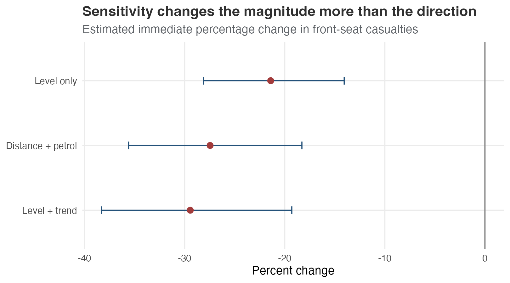
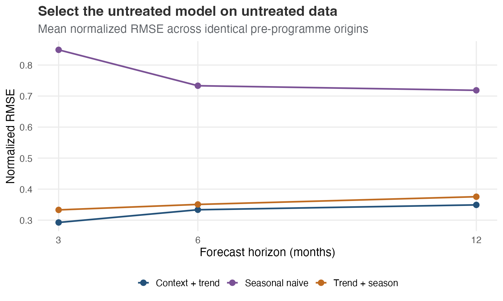

## A break is only as credible as its no-intervention path

::: {.kicker}
Interrupted time series estimates how an observed trajectory differs from a projected untreated trajectory. Timing, measurement, and competing events determine what that difference means.
:::

- preserve the trajectory instead of reducing it to two averages
- specify the intervention and effect shape before estimation
- model seasonality and dependence without confusing them with identification
- validate counterfactual choices on untreated data

::: {.notes}
[Sources] General ITS principles: @wagner2002segmented; @lopezbernal2017tutorial; @cochrane2024robinsits.
:::

## The design question comes before the model

| Design element | Seatbelt example |
|---|---|
| Intervention | Compulsory front-seat belt wearing |
| Start | 31 January 1983; February is the first treated month |
| Primary outcome | Front-seat passengers killed or seriously injured |
| Untreated path | Projected continuation of the pre-law series |
| Main threat | Other road-safety changes around 1983 |

The law date is external evidence, not a breakpoint selected from the casualty series [@ukparliament2012seatbelts].

## The built-in data make the case reproducible

`datasets::Seatbelts` contains 192 monthly observations from January 1969 through December 1984 [@rseatbeltsdata].

| Column | Measure |
|---|---|
| `front`, `drivers`, `rear` | Killed or seriously injured |
| `DriversKilled`, `VanKilled` | Deaths only |
| `kms` | Distance driven |
| `PetrolPrice` | Contextual price measure |
| `law` | Monthly intervention indicator |

Outcome labels matter: these are not interchangeable counts or ready-made rates.

## Plot the outcome before estimating the break

{fig-alt="Monthly front-seat passengers killed or seriously injured in Great Britain, with February 1983 marked as the first law month." width="94%"}

The graph reveals a long baseline, strong seasonality, an apparent decline, and only 23 post-law observations.

## Two averages discard the trajectory

{fig-alt="Monthly front-seat casualty counts with separate horizontal averages before and after the seatbelt law." width="92%"}

Pre/post means mix different calendar months, ignore the baseline trend, and compare periods of very different length.

## ITS projects the untreated path forward

{fig-alt="Observed front-seat casualties with fitted law and projected no-law trajectories." width="92%"}

The no-law path is estimated rather than observed. Its causal meaning depends on a stable outcome system and no competing same-date explanation [@lopezbernal2017tutorial].

## Specify the plausible effect shape before estimation

{fig-alt="Immediate, gradual, immediate plus gradual, and temporary intervention effect shapes." width="100%"}

Delivery knowledge should determine whether the model allows a step, slope change, ramp, lag, or temporary pulse.

## Segmented regression separates level and trend changes

$$
\log(Y_t) = \beta_0 + \beta_1t + \beta_2I_t + \beta_3T^{post}_t
      + \gamma_1\sin(2\pi t/12) + \gamma_2\cos(2\pi t/12) + \epsilon_t
$$

| Term | Interpretation |
|---|---|
| $I_t$ | Immediate proportional change in the first law month |
| $T^{post}_t$ | Change in monthly log trend after the law |
| Sine and cosine | Annual seasonal cycle |

At horizon $h$, the log-scale contrast is $\beta_2 + h\beta_3$.

## Post-intervention time starts at zero

::: {.columns}
::: {.column width="47%"}
### Interpretable coding

```r
law_start <- min(time[law == 1])
post_time <- ifelse(
  law == 1,
  time - law_start,
  0
)
```

At the first intervention observation, `post_time == 0`.
:::

::: {.column width="47%"}
### Misleading coding

```r
wrong_post_time <- time * law
```

The fitted line can look identical while the law coefficient moves to an irrelevant time origin [@xiao2021parameterization].
:::
:::

## Report effects at named horizons

$$
\widehat{\delta}(h) = \widehat{\beta}_2 + h\widehat{\beta}_3
$$

$$
\operatorname{Var}\{\widehat{\delta}(h)\}
= \operatorname{Var}(\widehat{\beta}_2)
+ h^2\operatorname{Var}(\widehat{\beta}_3)
+ 2h\operatorname{Cov}(\widehat{\beta}_2,\widehat{\beta}_3)
$$

- immediate, 6-month, and 12-month contrasts answer different questions
- log contrasts become percentages through $100\{\exp(\delta)-1\}$
- later horizons usually carry more trend uncertainty

## Seasonality and dependence are different problems

{fig-alt="Residual autocorrelation for OLS and normalized AR1 residuals." width="86%"}

- seasonality belongs in the expected outcome path
- serial dependence belongs in the residual model
- AR(1) errors can improve uncertainty estimates
- neither choice removes concurrent confounding

## Alternative outcomes add design evidence

{fig-alt="Indexed casualty series for front-seat passengers, car drivers, and rear-seat passengers." width="94%"}

Directly targeted outcomes should tell a coherent story. Nominally untargeted outcomes can reveal shared changes—but only if their causal role is credible.

## A candidate control is not automatically untreated

Rear-seat casualties are informative because adult rear-seat belt wearing was not compulsory until 1991 [@ukparliament2012seatbelts]. They are still imperfect because:

- passengers may have moved between front and rear seats
- exposure and severity differ by seating position
- the pre-law relationship may not remain stable

Van-driver deaths are an even weaker candidate: they track front-seat casualties poorly before the law and fall around the intervention themselves.

::: {.signal}
Controlled ITS is a design argument, not an interaction term alone.
:::

## Sensitivity should change one assumption at a time

{fig-alt="Immediate percentage changes under level-only, level-and-trend, and distance-plus-petrol specifications." width="79%"}

- level-only versus level-and-trend models change the effect shape
- distance driven changes the exposure interpretation
- petrol price is context, not the intervention
- stability of direction is useful; it does not eliminate confounding

## The 1983 break has competing explanations

The Parliamentary debate reviewing the law discussed stricter drink-driving enforcement and evidential breath testing as alternative contributors to the casualty decline [@ukparliament1986seatbeltdebate].

The defensible claim is therefore:

> Targeted casualty series fell relative to their projected paths, and front-seat casualties fell relative to rear-seat casualties. These data alone do not isolate compulsory belt wearing from every simultaneous road-safety change.

## Fit is not counterfactual performance

{fig-alt="Normalized forecast error for three candidate untreated models at 3, 6, and 12 month horizons." width="77%"}

When no comparison series is credible:

1. choose common pre-intervention forecast origins;
2. score every candidate at the same reporting horizons;
3. select without post-intervention outcomes;
4. retain a near-performing comparator; and
5. stop when predictors leave their training support.

## The three labs now have one job each

| Lab | Core question | Data |
|---|---|---|
| Foundations | How do level, trend, seasonality, and dependence work? | Seatbelts |
| Design and robustness | Which outcomes, controls, and sensitivities are defensible? | Seatbelts |
| Counterfactual validation | Which untreated forecast survives held-out testing? | Minimal known-truth simulation |

Each notebook has a 45–60 minute guided core and a clearly marked optional extension.

## Report a chain of evidence

1. Outcome definition and intervention evidence.
2. Raw series and data-quality checks.
3. Prespecified effect shape and segmented model.
4. Residual, sensitivity, and comparison diagnostics.
5. Named horizon-specific contrasts with uncertainty.
6. Concurrent events and measurement limitations.
7. The strongest claim the design can support.

::: {.signal}
A model estimates the break. The design determines what the break means.
:::

## The design makes the break interpretable

- preserve the trajectory
- code the interruption from external evidence
- distinguish level, trend, seasonality, and dependence
- defend every comparison and contextual variable
- validate forecasts without post-intervention outcomes
- stop before the evidence becomes extrapolation

## Appendix: Monthly aggregation can blur the intervention {.section-slide}

The law began on the final day of January 1983, so February is the first fully treated month. When an intervention begins part-way through an aggregation period, a sharp monthly step can mix treated and untreated exposure and bias the apparent immediate effect [@turner2026aggregation].

## Appendix: Dynamic intervention models answer related questions

ARIMA intervention models, state-space models, distributed lags, and segmented regression can represent different baseline and effect dynamics. The original seatbelt analysis used structural time-series modelling [@harvey1986seatbelts]. Choose complexity for a stated feature of the outcome system, not because it produces a stronger result.

## Appendix: A control cannot repair a treated-only break

A comparison can remove a genuinely shared shock. It cannot distinguish a real intervention effect from a measurement change, composition shift, or other event affecting only the treated series. Those threats require provenance, implementation evidence, or a different design.

## Sources {.smaller .scrollable}

- @harvey1986seatbelts
- @lopezbernal2017tutorial
- @lopezbernal2018controls
- @rseatbeltsdata
- @ukparliament2012seatbelts
- @ukparliament1986seatbeltdebate
- @wagner2002segmented
- @xiao2021parameterization
