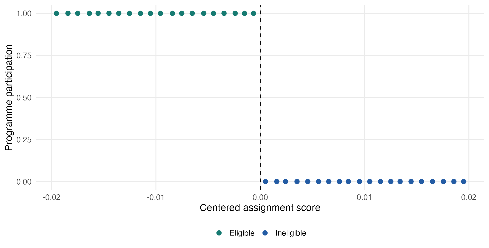
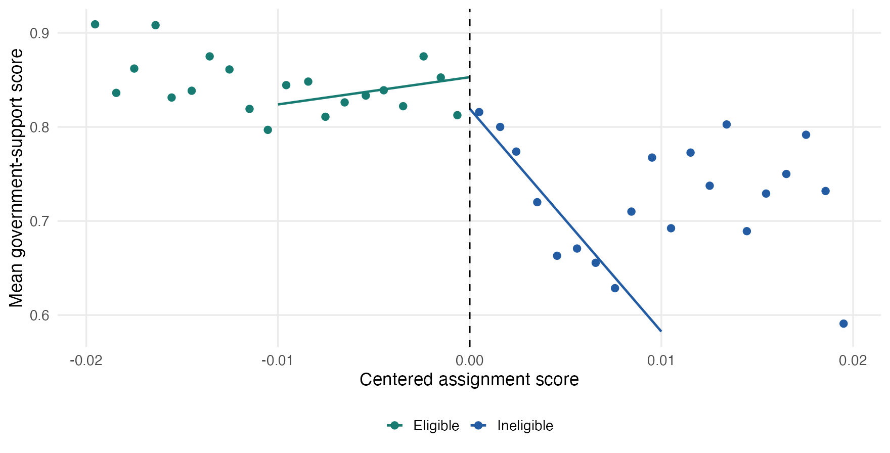
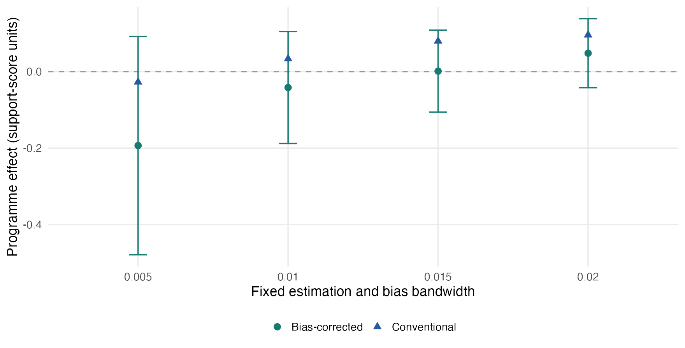
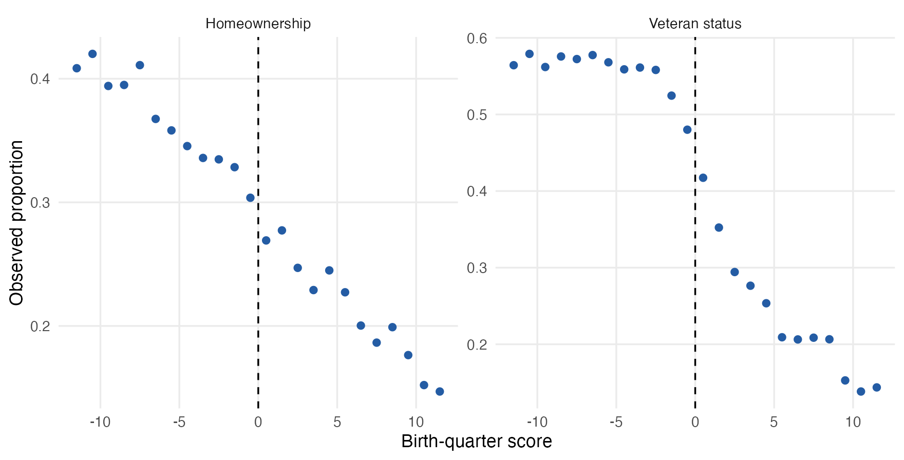

## The rule creates the comparison

Units just below and above a known threshold can reveal a **local treatment effect**.

The question is whether their outcomes would otherwise vary smoothly through that threshold.

::: {.notes}
Allow 2 minutes. Ask for a real eligibility rule, then ask which side receives treatment. RD starts with a rule, not a search for an interesting break. By the end, learners should distinguish sharp and fuzzy designs, interpret the local effect, and assess diagnostic evidence. Sources: @gertler2016ch6rdd; @cunningham2021rdd.
:::

## Write down the assignment mechanism

| Element | Question |
|---|---|
| Score and cutoff | What was recorded before treatment? |
| Eligibility and receipt | Who qualifies, and who participates? |
| Outcome | What changes, for whom, and when? |
| Competing rules | What else changes at the same cutoff? |

::: {.notes}
Allow 2 minutes. Eligibility is not the same as receipt. Ask whether the administrative score was revised later, whether units knew the threshold, and whether several benefits share it. A second policy at the same cutoff complicates attribution even when the score is impossible to manipulate.
:::

## Sharp and fuzzy designs answer different questions

- **Sharp:** crossing the threshold determines treatment.
- **Fuzzy:** crossing changes the probability of treatment.
- Both need a credible local comparison; fuzzy RD also needs an IV argument.

::: {.notes}
Allow 2 minutes. Draw the distinction in terms of observed treatment receipt, not the visual clarity of an outcome jump. Fuzzy RD is not a noisier sharp estimate. Its local-complier interpretation adds relevance, exclusion, and monotonicity. Sources: @huntingtonklein2025rdd.
:::

## PANES provides a sharp teaching case

| Design element | Application |
|---|---|
| Programme | Uruguay's PANES |
| Assignment | Participation below centered score zero |
| Outcome | Government-support score: 0, 0.5, or 1 |
| Outcome sample | 1,948 observations near the threshold |

::: {.notes}
Allow 2 minutes. Emphasize that the outcome is not binary and the treatment is a programme package. The bundled snapshot supports a teaching analysis, not a new full replication of every result in the original paper. Source: @manacorda2011transfers.
:::

## Treatment is on the left

{height="430px" fig-alt="Programme participation is one below zero and zero above zero."}

Right minus left is the opposite of the programme-effect direction.

::: {.notes}
Allow 2 minutes. Ask learners to predict the sign of the software coefficient if the programme raises support. It will be negative when the software reports right minus left. This sign check must precede interpreting a confidence interval.
:::

## Continuity supplies the missing outcome

Without the programme, mean potential outcomes must be continuous at the cutoff.

- No separate outcome-changing policy at the same threshold.
- No precise sorting that breaks the comparison.
- No discontinuous selection into outcome observation.

::: {.notes}
Allow 3 minutes. Continuity is a claim about limits, not identical people or flat regression lines. Slopes may differ. Ask what institutional evidence could threaten each condition. Large samples and a small p-value cannot establish continuity. Sources: @cunningham2021rdd.
:::

## The effect is local

For treatment on the right:

$$
\tau=\lim_{x\downarrow0}E[Y\mid X=x]-\lim_{x\uparrow0}E[Y\mid X=x].
$$

For PANES, reverse the sign. The target is the effect at the threshold, not the average effect for all participants.

::: {.notes}
Allow 2 minutes. Walk through the right and left limits, then reverse the treatment direction for PANES. Ask whether the poorest participants are represented by a near-eligibility-threshold effect. External validity requires additional assumptions and evidence.
:::

## Plot the score before choosing a model

{height="430px" fig-alt="Binned support scores with local fitted lines on each side of the cutoff."}

Binning describes the data; local regression estimates the jump.

::: {.notes}
Allow 2 minutes. Point out that the lines stop at the estimation window while bins show the wider sample. No bin crosses the cutoff. The visual bin width is not the estimation bandwidth. Avoid extrapolating a high-order global polynomial through the whole score range.
:::

## A local line makes the jump inspectable

Within $|X|<h$, fit

$$Y=\alpha+\tau R+\beta X+\gamma RX+u,$$

where $R=1[X\geq0]$, with triangular weights $1-|X|/h$.

At $X=0$, $\tau$ is the right-minus-left intercept difference.

::: {.notes}
Allow 3 minutes. Explain separate slopes and the score centered at zero. With h=0.01 there are 537 left and 400 right observations. The foundations lab checks this regression against separate local lines and rdrobust. The programme contrast is minus tau.
:::

## Bandwidth trades approximation against information

- Narrow windows use more local comparisons but fewer observations.
- Wider windows use more information but stronger approximation.
- Report the selected window, effective sample, and score support.

::: {.notes}
Allow 2 minutes. Automatic bandwidth selection optimizes a statistical criterion, not causal validity. Ask how repeated observations at identical score values differ from more distinct nearby scores. Keep the estimation bandwidth separate from the visual bin width.
:::

## Bias-aware inference changes what is reported

| Fixed window: 0.01 | Programme effect |
|---|---:|
| Conventional estimate | +0.0335 |
| Bias-corrected estimate | -0.0416 |
| Robust 95% interval | [-0.1880, 0.1048] |

Units are **support-score units**, not binary percentage points.

::: {.notes}
Allow 3 minutes. These rounded values are checked by the core report and foundations lab. A local boundary approximation can have non-negligible bias. Do not attach an unlabeled robust interval to a conventional estimate or hide the sign change. Negating an interval requires swapping endpoints. Sources: @cunningham2021rdd.
:::

## Sensitivity belongs beside the estimate

{height="430px" fig-alt="Four bandwidth specifications show conventional and corrected effects with robust intervals crossing zero."}

Report dependence on the window, not just the preferred row.

::: {.notes}
Allow 2 minutes. All rows use local linear fits, triangular kernels, and the same fixed h and b within a row. Changing both bandwidths is explicit. The graph supports a local and imprecise conclusion under these specifications, not a selected-sign policy claim.
:::

## Density evidence needs the right sample

Use the separate assignment-score file, not the selected outcome survey.

- 52,549 scores in the supplied file.
- 20,463 within 0.02 of the cutoff.
- A non-rejection does not prove that manipulation is absent.

::: {.notes}
Allow 2 minutes. Outcome-survey selection could itself change the score density. Discuss how administrative discretion, heaping, and knowledge of the rule affect interpretation. The diagnostics lab runs rddensity on the designated score sample. Sources: @manacorda2011transfers; @huntingtonklein2025rdd.
:::

## Covariate checks require a timeline

Use characteristics measured before treatment and report missingness.

In this file, the timing of Age and Education is not established as pre-treatment. Education has 51 missing values.

Call these **observed-covariate checks**, not confirmed baseline balance.

::: {.notes}
Allow 2 minutes. Ask why a programme might change education or who appears in the survey. Use variable-specific complete cases rather than dropping missing education from the main outcome model. A large balance-test p-value is not a design certificate.
:::

## Placebos and donuts test specific concerns

- Placebo windows must not cross the real treatment threshold.
- A donut exclusion removes the closest observations and requires extrapolation.
- Local quadratic checks need sufficient distinct score support.

::: {.notes}
Allow 2 minutes. A placebo at 0.01 with h=b=0.004 stays in one regime. A donut may address heaping but is not a universal manipulation correction. Prespecify why each check matters and report its changed sample and estimand assumptions.
:::

## Fuzzy RD uses two discontinuities

{height="430px" fig-alt="Quarter-level veteran-status and homeownership proportions around the cutoff, showing coarse score support."}

The threshold changes receipt probability, not deterministic receipt.

::: {.notes}
Allow 2 minutes. The veteran example is separate from PANES. Note the quarter-level support and the downward first stage from left to right. The outcome is binary here, unlike the PANES support score. Source: @fetter2013mortgages.
:::

## The local Wald ratio connects outcome and receipt

$$\tau_{FRD}=\frac{\text{outcome jump}}{\text{receipt jump}}.$$

Use the **same sample, weights, and score controls** for both jumps.

At 12 quarters: $-0.0226/-0.1213\approx0.1863$.

::: {.notes}
Allow 3 minutes. The ratio is about 18.63 percentage points of homeownership for the conventional specification. Both jumps use right minus left; reversing only one gives a wrong sign. The fuzzy lab checks the ratio against matched weighted IV. Ordinary second-stage standard errors using fitted treatment are not valid IV inference.
:::

## Fuzzy identification adds assumptions

- Relevance: the threshold changes treatment receipt.
- Exclusion: no other threshold channel changes the outcome.
- Monotonicity: receipt responds in a consistent direction.
- Continuity: the local untreated comparison remains credible.

::: {.notes}
Allow 3 minutes. The target is local compliers under the stated assumptions. An effect of veteran status is not necessarily the effect of mortgage assistance alone. A numerical minimum first-stage threshold is not a weak-instrument test. Report uncertainty and investigate weak identification. Sources: @fetter2013mortgages; @huntingtonklein2025rdd.
:::

## Many people do not create continuous support

The widest fuzzy window contains 56,901 people but only **12 distinct quarters per side**.

Discuss functional form and extrapolation. Do not apply a continuous-score density test to discrete birth quarters.

::: {.notes}
Allow 2 minutes. Repeated observations improve precision at a score; they do not move that score closer to the cutoff. Clustering by quarter does not automatically repair approximation bias. Conventional ratios change across 6, 9, and 12-quarter windows; use that as evidence about sensitivity.
:::

## Report the design and its limits

- Assignment rule, treatment direction, target population, and cutoff.
- Score support, missingness, bandwidths, kernel, and polynomial orders.
- Conventional and corrected estimates with robust uncertainty.
- Diagnostic evidence, sensitivity, and limits to generalization.

::: {.notes}
Allow 2 minutes. Ask for a conclusion that names the local population and one remaining threat. A clear but limited claim is stronger than an unqualified programme-wide claim. The core report provides the executable tables behind the sharp and fuzzy examples.
:::

## Three R labs continue the sequence

| Lab | Main task |
|---|---|
| Sharp foundations | Audit assignment and estimate a local jump |
| Diagnostics | Assess continuity and specification sensitivity |
| Fuzzy RD | Connect receipt, outcomes, and local IV |

[Core report](../labs/regression-discontinuity-methods-report.qmd) · [Labs and offline downloads](../labs/index.qmd#regression-discontinuity-labs)

::: {.notes}
Allow 1 minute. Each lab has Quarto, an R Jupyter notebook, bundled data, and a complete ZIP. Start with the sharp foundations and a short design assessment before proceeding to diagnostics. The report and practical guide are reference readings rather than additional notebook exercises.
:::

## Appendix: Estimation and bias bandwidths

`p=1` fits local lines; `q=2` estimates the leading bias.

The estimation bandwidth $h$ and bias bandwidth $b$ have different jobs. Report both, including left/right values when they differ.

::: {.notes}
The fixed examples set h=b for transparency. MSE-selected bandwidths need not do so. Robust bias correction accounts for variability introduced by estimating the bias; ordinary local-regression intervals do not. Refer to the full rdrobust output and the executable core report.
:::

## Appendix: Fuzzy estimates are not interchangeable

| 12-quarter window | Homeownership effect |
|---|---:|
| Conventional ratio | 0.1863 |
| Bias-corrected estimate | 0.3093 |
| Robust 95% interval | [0.1057, 0.5130] |

Report the first stage and the coarse-support caveat alongside these numbers.

::: {.notes}
The core report verifies the conventional ratio against rdrobust on the same complete-case sample. The interval belongs to the corrected estimate with robust inference. These are teaching specifications, not a claim that coarse support or the exclusion restriction has been resolved.
:::

## Sources {.smaller .scrollable}

[Reading map](../notes/rdd/regression-discontinuity-sources.qmd) · [Executable core report](../labs/regression-discontinuity-methods-report.qmd)

::: {#refs}
:::
