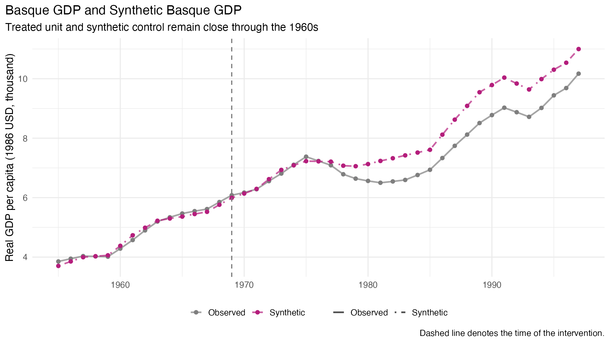
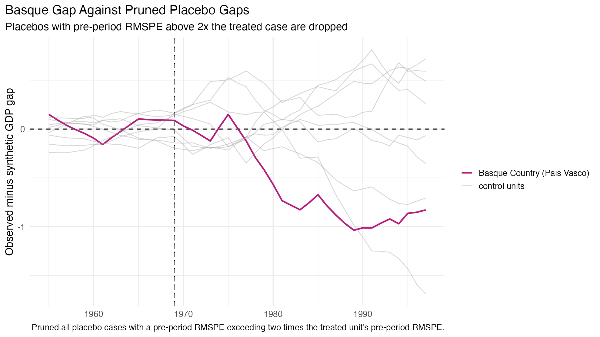
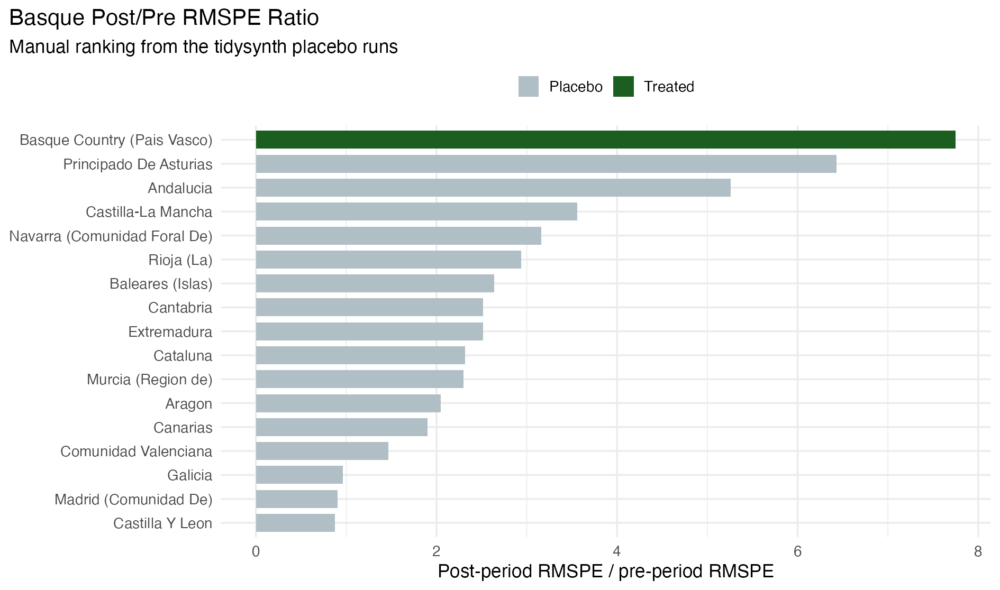

## Session Promise

::: {.kicker}
This short deck explains synthetic control as a comparative-case-study design before it explains any specific package workflow.
:::

- start from the missing counterfactual for one treated place
- show why SCM improves on both hand-picked controls and hidden regression extrapolation
- separate contextual requirements from data requirements before talking about inference
- keep the limits explicit throughout [@abadie2010synthetic; @abadie2021using; @cunningham2021mixtape]

## 20-Minute Arc

| Time | Segment | Purpose |
|---|---|---|
| `0-3` | Counterfactual problem | Why aggregate interventions need a comparison rule |
| `3-6` | Why SCM exists | Why ad hoc controls and linear extrapolation are both weak defaults |
| `6-10` | Support and requirements | Why donor support, context, and data come before estimation |
| `10-14` | Fit and inference | Why pre-treatment fit and permutation logic carry the argument |
| `14-17` | Robustness and extensions | How to stress-test the design and when to extend it |
| `17-20` | Labs and close | How the learning sequence maps onto the design logic |

## Start With The Comparative Case Problem

- many interventions happen to one state, city, firm, or region rather than to many randomly assigned units
- the treated unit's untreated outcome is therefore missing
- the design task is to construct a credible stand-in for that missing untreated path
- SCM is one answer to that problem when one comparison unit is not enough [@abadie2010synthetic; @cunningham2021mixtape]

## Why Not Just Hand-Pick A Few Controls?

- classical comparative case studies are often substantively sharp but counterfactually vague
- the basic question is always "why these comparison units and not others?"
- SCM answers that by choosing weights over a donor pool through an explicit rule rather than informal judgment
- that does not remove judgment; it relocates it into donor-pool design, predictors, and diagnostics [@abadie2010synthetic; @hainmueller2011synth]

## Why Not Just Run Regression?

- regression can reproduce treated-unit predictors by using negative weights and extrapolation outside donor support
- SCM keeps weights non-negative and summing to one, so the comparison stays inside observed support
- the gain is transparency: remaining mismatch stays visible instead of being hidden by functional-form rescue
- because the weights depend on pre-treatment information, they can often be fixed before post-treatment outcomes are seen [@abadie2021using; @abadie2010synthetic]

## SCM In One Sentence

::: {.card-grid}
::: {.mini-card}
**Treated unit**

One aggregate unit receives the intervention.
:::

::: {.mini-card}
**Donor pool**

Untreated units supply candidate comparison material.
:::

::: {.mini-card}
**Synthetic control**

A weighted average of donors reconstructs the treated unit before treatment.
:::
:::

## Design Bottleneck: The Donor Pool

- the donor pool is not a software input; it is the main identification decision
- donors should be untreated, comparable, and measured on the same outcome process
- contaminated or structurally different units weaken the design before estimation even starts
- if support is weak, no optimizer can rescue the case [@abadie2021using; @abadie2010synthetic]

## Why The Convex-Hull Rule Matters

- classical SCM restricts donor weights to be non-negative and to sum to one
- that keeps the synthetic control inside the support of observed donors
- the gain is no hidden extrapolation
- the cost is that some treated units cannot be matched well because they sit outside donor support [@abadie2010synthetic; @hainmueller2011synth]

## Contextual Requirements Come First

- the treatment effect has to be large enough relative to the volatility of the outcome
- untreated units must stay untreated and avoid major idiosyncratic shocks during the study window
- anticipation and interference need design responses, not post hoc excuses
- the time horizon has to be long enough for any effect to emerge in the observed data [@abadie2021using; @mixtape-synthetic-control-and-clustering]

## Data Requirements Are Not Optional

- SCM needs aggregate outcomes and predictors measured on units that are genuinely comparable
- long pre-treatment panels matter because they reveal whether the synthetic path tracks stable structure rather than noise
- enough post-treatment periods matter because some effects accumulate rather than jump on impact
- short pre-treatment windows plus many donor candidates create real overfitting risk [@abadie2021using; @abadie2010synthetic]

## Strong Pre-Treatment Fit Is The Main Credibility Test

- SCM is persuasive only when treated and synthetic outcomes line up closely before treatment
- long pre-treatment panels help distinguish structural resemblance from noise
- poor pre-treatment fit is usually a stop sign, not a minor inconvenience
- that is why SCM is a diagnostics-heavy design rather than a one-line estimator [@abadie2021using; @mixtape-synthetic-control-and-clustering]

## What The Core Outputs Mean

- donor weights: which units actually build the comparison
- balance table: whether key predictors and lagged outcomes line up
- path plot: whether treated and synthetic units track before treatment
- gap plot: whether divergence appears only after treatment
- placebo checks: whether the treated gap looks unusually large relative to comparable untreated cases [@abadie2010synthetic; @hainmueller2011synth]

## Basque Country: The Origin SCM Case

::: {.columns}
::: {.column width="40%"}
- original research aim: estimate the economic cost of political conflict in the Basque Country
- treated unit: Basque Country
- donor pool: the other Spanish regions, excluding Spain-wide aggregate data
- outcome: real GDP per capita
- pre-treatment fit window: `1960` to `1969`
- `tidysynth` recovers the classic sparse solution almost exactly:

| Donor | Weight |
|---|---:|
| Cataluna | `0.851` |
| Madrid (Comunidad De) | `0.149` |

That is the original comparative-case-study promise of SCM in one table [@abadie2003economic; @hainmueller2011synth].
:::

::: {.column width="60%"}
{fig-alt="Line chart comparing observed Basque GDP per capita and synthetic Basque GDP, with a vertical intervention line at 1969." width="100%"}
:::
:::

## Basque In `tidysynth`

```r
.libPaths(c("/tmp/Rlib", .libPaths()))
library(Synth)
library(tidysynth)
library(dplyr)

data(basque, package = "Synth")

basque_td <- basque |>
  filter(regionno != 1) |>
  mutate(
    total_school = school.illit + school.prim + school.med +
      school.high + school.post.high,
    school_illit_share = 100 * school.illit / total_school,
    school_prim_share  = 100 * school.prim  / total_school,
    school_med_share   = 100 * school.med   / total_school,
    school_high_share  = 100 * (school.high + school.post.high) / total_school
  )

basque_out <- basque_td |>
  synthetic_control(
    outcome = gdpcap, unit = regionname, time = year,
    i_unit = "Basque Country (Pais Vasco)", i_time = 1969,
    generate_placebos = TRUE
  ) |>
  generate_predictor(
    time_window = 1964:1969,
    school_illit_share = mean(school_illit_share, na.rm = TRUE),
    school_prim_share  = mean(school_prim_share,  na.rm = TRUE),
    school_med_share   = mean(school_med_share,   na.rm = TRUE),
    school_high_share  = mean(school_high_share,  na.rm = TRUE),
    invest = mean(invest, na.rm = TRUE)
  ) |>
  generate_predictor(time_window = 1960:1969, gdpcap_1960_1969 = mean(gdpcap, na.rm = TRUE)) |>
  generate_predictor(time_window = seq(1961, 1969, 2),
    sec_agriculture = mean(sec.agriculture, na.rm = TRUE),
    sec_energy = mean(sec.energy, na.rm = TRUE),
    sec_industry = mean(sec.industry, na.rm = TRUE),
    sec_construction = mean(sec.construction, na.rm = TRUE),
    sec_services_venta = mean(sec.services.venta, na.rm = TRUE),
    sec_services_nonventa = mean(sec.services.nonventa, na.rm = TRUE)
  ) |>
  generate_predictor(time_window = 1969, popdens_1969 = mean(popdens, na.rm = TRUE)) |>
  generate_weights(optimization_window = 1960:1969,
    Margin.ipop = 0.02, Sigf.ipop = 7, Bound.ipop = 6) |>
  generate_control()
```

This is the same design logic as the classic `Synth` example, but expressed as a tidy pipeline.

## Basque Balance Table

::: {style="font-size: 0.73em;"}
| Predictor | Basque | Synthetic | Donor avg |
|---|---:|---:|---:|
| `invest` | `24.62` | `21.58` | `21.44` |
| `school_high_share` | `3.26` | `3.10` | `2.68` |
| `school_illit_share` | `3.32` | `7.65` | `11.05` |
| `school_med_share` | `7.46` | `6.92` | `5.41` |
| `school_prim_share` | `85.95` | `82.33` | `80.85` |
| `gdpcap_1960_1969` | `5.29` | `5.27` | `3.58` |
| `sec_agriculture` | `6.84` | `6.18` | `21.40` |
| `sec_construction` | `6.15` | `6.95` | `7.28` |
| `sec_energy` | `4.11` | `2.76` | `5.31` |
| `sec_industry` | `45.08` | `37.64` | `22.36` |
| `sec_services_nonventa` | `4.07` | `5.37` | `7.11` |
| `sec_services_venta` | `33.76` | `41.11` | `36.50` |
| `popdens_1969` | `246.89` | `195.63` | `99.39` |
:::

The point of the table is not perfection on every row. The point is that the synthetic Basque unit is plainly closer than the donor average on the predictors that anchor the design.

## Basque Placebo Tests

{fig-alt="Line chart showing the Basque observed-minus-synthetic GDP gap against pruned placebo gaps from donor regions, with a vertical line at 1969." width="100%"}

- the placebo-gap plot compares Basque to donor regions reassigned as if they were treated
- the plotted version prunes placebo runs with pre-period RMSPE above `2x` the treated unit
- the visual lesson is that Basque diverges more sharply after treatment than the comparable placebo cases

## Basque Post/Pre RMSPE Ratio

{fig-alt="Horizontal bar chart ranking Basque and placebo units by post-period to pre-period RMSPE ratio, with Basque highest." width="82%"}

- Basque has the largest post/pre RMSPE ratio in the full placebo run: `7.75`
- with only `16` donor regions, exact p-values are coarse; rank `1/17` implies about `0.059`
- under the common `2x` pruning rule, Basque still ranks first: `1/9`
- the teaching lesson is that the effect looks unusual, but inference remains fit-sensitive and small-sample [@abadie2003economic; @abadie2010synthetic]

## Permutation Logic Is A Benchmark, Not A Magic Trick

- placebo-by-unit reassignment asks whether the treated gap looks unusual within the donor pool's feasible comparison set
- placebo-in-time checks ask whether the same design would create fake effects when treatment is backdated
- p-values are secondary to the more basic question of whether the placebo cases had comparable pre-treatment fit
- good inference reinforces a strong design; it does not rescue a weak one [@abadie2010synthetic; @abadie2021using]

## Robustness Checks And Failure Modes

- vary donor-pool inclusion rules, predictor sets, and pre-treatment windows in ways you can justify substantively
- backdate treatment when anticipation is a concern and inspect whether fake effects appear
- inspect spillovers, contamination, and concurrent shocks hitting high-weight donors or the treated unit
- dramatic plots do not compensate for poor support, weak fit, or brittle design choices [@abadie2021using; @mixtape-synthetic-control-and-clustering]

## When Classical SCM Is Enough

- one treated unit or a very small treated set
- clear intervention timing
- a clean donor pool
- long pre-treatment history
- close treated-versus-synthetic fit before treatment

If those conditions hold, classical SCM is often the right stopping point.

## When Penalization Or Augmentation Enter

- penalized SCM keeps convex weights but discourages placing weight on donors that are far from the treated unit [@Abadie_LHour_2021_PenalizedSCM]
- augmented SCM starts from SCM and then corrects remaining bias with a controlled outcome model when classical fit is still weak [@benmichael2021augmented]
- these are extensions for different problems, not generic upgrades over classical SCM
- if either extension has to carry the whole design, the deeper lesson may still be that the case is weak

## Learning Arc For This Sequence

| Level | Case | Main lesson |
|---|---|---|
| Origin case | Basque Country with `Synth::basque` data in `tidysynth` | Learn the original SCM case, sparse donor weights, and fit-sensitive placebo logic |
| Introductory | `Synth::synth.data` | Learn `dataprep()`, `synth()`, weights, and gap plots |
| Intermediate | Proposition 99 with `tidysynth::smoking` | Learn the full classical SCM workflow and donor-pool discipline |
| Advanced | `augsynth::kansas` | Learn what to do when classical fit is weak |

## Closing Line

The practical rule is simple: prefer transparent support over hidden extrapolation, demand strong pre-treatment fit, treat placebo inference as a benchmark rather than magic, and only then decide whether classical SCM, penalization, or augmentation is justified.
